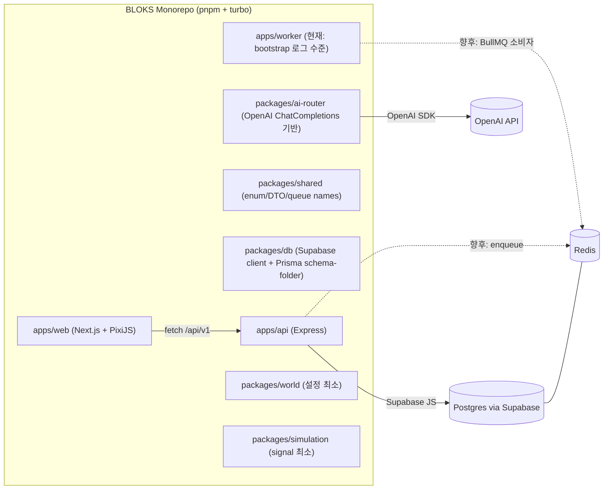
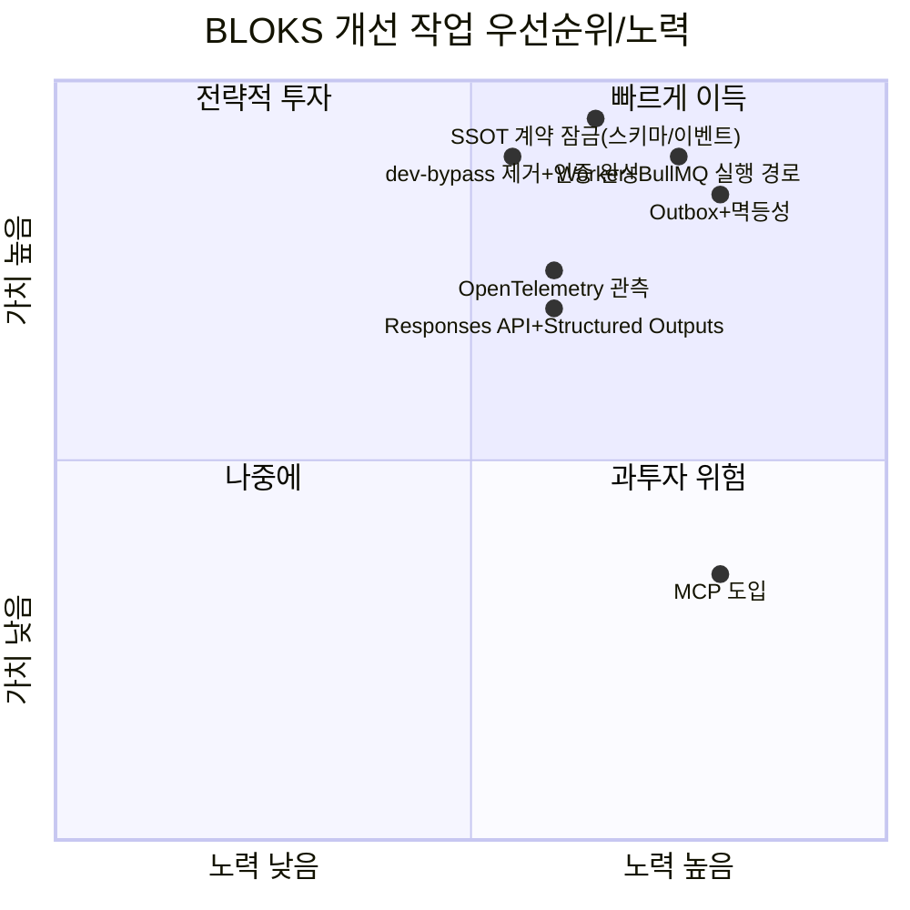
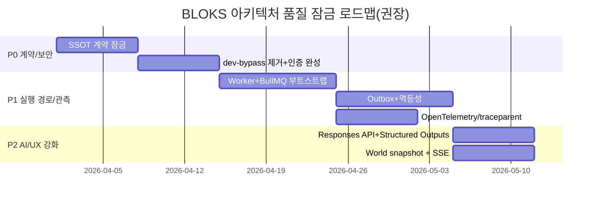
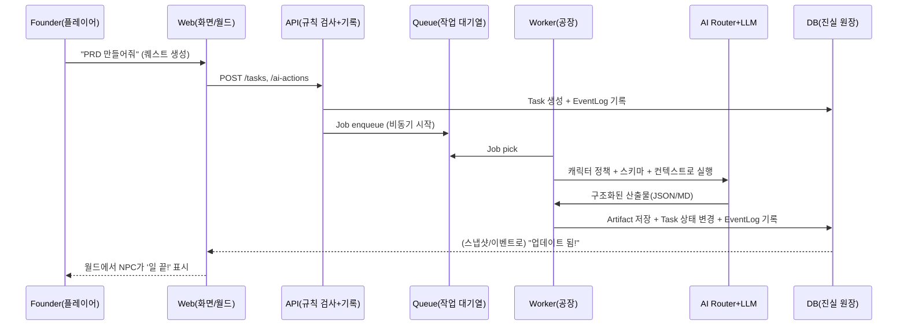

> ⚠️ **[ARCHIVED 2026-05-21]** 구현 완료 — 더 이상 업데이트하지 않습니다.

# BLOKS 멀티에이전트 시스템 심층 분석 및 아키텍처 개선 권고 보고서

## 경영진 요약

활성 커넥터는 **GitHub** 하나이며, 본 보고서는 GitHub 저장소 **wsjung2023/BLOKS**의 기획/설계 문서와 현재 코드 상태를 먼저 정밀 분석한 뒤, 신뢰도 높은 외부 1차 자료(공식 문서·표준·원문 보고서·한국 기관 자료)를 근거로 아키텍처 완성도와 품질을 끌어올리기 위한 **우선순위 기반의 구체적 설계 변경안**을 제시합니다. (커넥터: github)

BLOKS는 문서 설계가 ‘게임처럼 보이는 운영툴’이 아니라 **“운영툴이 본체인데, 게임처럼 보이도록 연출하는 시스템”**으로 아주 명확합니다. 핵심 원칙은 `web/api/worker` 분리, PostgreSQL(레코드의 진실 원장), Event Log, AI Router 중앙 통제, Redis+BullMQ 비동기 처리, 2~5초 스냅샷+중요 이벤트 push의 혼합 “실시간처럼 보이기” 전략입니다. 이 방향성은 07/08/09/10/11 문서에서 일관되게 강조됩니다. fileciteturn112file0L1-L1 fileciteturn113file0L1-L1 fileciteturn114file0L1-L1 fileciteturn120file0L1-L1 fileciteturn115file0L1-L1

하지만 **현재 구현(코드)은 ‘문서 설계’에 비해 골격만 있고, 신뢰성/보안/일관성에서 P0급 갭이 큽니다.** 특히 아래가 가장 치명적입니다.

- **SSOT(단 하나의 진실 원천) 문서(11)까지 있는데도, 코드·DB·API·UI 간 필드/테이블 계약이 어긋난 지점이 다수** 보입니다(예: 런타임 상태 필드명, event_logs 컬럼 구성, job을 event_logs로만 기록하는 방식 등). fileciteturn115file0L1-L1 fileciteturn149file0L1-L1 fileciteturn150file0L1-L1 fileciteturn127file0L1-L1  
- Worker는 아직 **BullMQ/Redis 소비자가 아닌 “부팅 로그” 수준**이며, 문서에서 표준으로 정의한 큐 기반 장기 실행 경로가 작동하지 않습니다. fileciteturn143file0L1-L1 fileciteturn114file0L1-L1 fileciteturn115file0L1-L1  
- AI Router는 문서가 “OpenAI Responses API + structured outputs 우선”을 지향하는데, 현재 구현은 **Chat Completions + `json_object` JSON 모드** 중심이며, 스키마 준수 보장(Structured Outputs)·재시도·검증·감사로그 정책이 약합니다. fileciteturn112file0L1-L1 fileciteturn141file0L1-L1 citeturn4search0turn4search1turn4search4  
- 보안 측면에서 **dev-bypass 토큰, service role key 기반 Supabase 접근** 등은 MVP 편의로는 이해되지만, 프로덕션/공개 레포 관점에서는 반드시 정리해야 할 “폭탄 스위치”입니다. Supabase는 service key가 RLS를 우회할 수 있으므로 노출 금지임을 명시합니다. fileciteturn125file0L1-L1 fileciteturn146file0L1-L1 fileciteturn133file0L1-L1 citeturn5search1  

따라서 권고의 핵심은 단순 기능 추가가 아니라, **“계약(스키마/이벤트/잡/상태) 정본화 → 신뢰성 있는 실행 경로(큐·멱등·아웃박스) 구축 → 보안/관측 가능성/테스트로 품질 잠금”** 순서로 잡아야 합니다. OWASP는 API 보안에서 ‘민감 비즈니스 플로우 무제한 노출’, ‘자원 무제한 소비’ 같은 위험을 별도로 강조합니다(특히 자동화/봇이 쉬운 시스템일수록). citeturn2search2turn2search1

요약하면, BLOKS는 “설계 문서”는 이미 상위권입니다. 지금 필요한 건 “문서의 법전(11)대로 실제 코드·데이터·운영이 **같은 언어로 말하게 만드는 것**”입니다. 그 다음부터 진짜 BLOKS가 살아납니다. fileciteturn115file0L1-L1

## GitHub 저장소 기반 현행 아키텍처와 컴포넌트 역할

### 모노레포 구조와 빌드 시스템

루트는 `pnpm` 워크스페이스 + `turbo` 태스크 러너 기반 모노레포입니다. 루트 스크립트는 `turbo dev/build/lint/test`와 DB 작업(prisma generate/migrate/seed 등)을 포함합니다. fileciteturn109file0L1-L1 fileciteturn110file0L1-L1 fileciteturn111file0L1-L1

문서(07/08)는 목표 구조를 `apps/web`, `apps/api`, `apps/worker`로 분리하고, `packages/shared`, `packages/db`, `packages/ai-router`, `packages/world`, `packages/simulation` 등을 공유 계층으로 둡니다. fileciteturn112file0L1-L1 fileciteturn113file0L1-L1

### 앱 계층

`apps/web`은 Next.js 15 + React 기반이며, PixiJS로 아이소메트릭 월드를 렌더링합니다. dependencies에 `pixi.js`가 있고, 월드 페이지는 `IsometricWorldCanvas`를 로드합니다. fileciteturn144file0L1-L1 fileciteturn147file0L1-L1 fileciteturn148file0L1-L1

`apps/api`는 Express 기반 API 서버이며, `/api/v1` 아래에 characters/tasks/projects/approvals/artifacts/events/jobs 라우터를 붙입니다. 인증은 JWT 미들웨어가 있으나 dev-bypass 토큰 예외가 정의되어 있습니다. fileciteturn123file0L1-L1 fileciteturn124file0L1-L1 fileciteturn125file0L1-L1

`apps/worker`는 현재는 큐 소비자/스케줄러가 아니라, 정본 큐 이름을 출력하는 부트스트랩 로그 수준입니다(문서의 BullMQ 기반 비동기 설계와 갭). fileciteturn142file0L1-L1 fileciteturn143file0L1-L1 fileciteturn114file0L1-L1

### 데이터 계층

로컬 개발 인프라는 `pgvector/pgvector:pg16` Postgres + Redis docker-compose로 제공됩니다. fileciteturn160file0L1-L1

DB 접근은 현재 두 축이 공존합니다.

- ORM 스펙: `packages/db`에 Prisma schema-folder(멀티 파일) 구조가 있고, 상태머신·조직·업무 엔티티의 enum과 모델들이 정의돼 있습니다. fileciteturn134file0L1-L1 fileciteturn135file0L1-L1 fileciteturn136file0L1-L1 fileciteturn137file0L1-L1  
- 런타임 구현: 실제 API 라우터는 Prisma가 아니라 **Supabase JS 클라이언트**로 테이블에 직접 접근합니다. `packages/db/src/supabase.ts`는 service-role 키가 있으면 그 키로, 없으면 anon/publishable 키로 생성합니다. fileciteturn133file0L1-L1 fileciteturn124file0L1-L1 fileciteturn126file0L1-L1

이 이중 구조는 “장기적으로는 가능”하지만, 지금은 **계약 불일치·마이그레이션 혼선·권한 모델 혼란(특히 RLS)**의 강한 위험 신호입니다. Supabase는 RLS 활성화와 서비스 키의 RLS 우회 가능성(브라우저 노출 금지)을 명확히 안내합니다. citeturn5search1

### AI 계층

`packages/ai-router`는 OpenAI SDK와 Anthropic SDK를 의존하지만, 정본(11) 규칙에 따라 “MVP 단일 provider(OpenAI)”로 라우팅하도록 구현돼 있습니다. fileciteturn139file0L1-L1 fileciteturn140file0L1-L1 fileciteturn115file0L1-L1

다만 OpenAI 호출 구현은 Chat Completions 기반이며, JSON 응답은 `response_format: { type: "json_object" }` 형태로 처리합니다. fileciteturn141file0L1-L1  
OpenAI는 새 프로젝트에 “Responses API”를 ‘가장 진보한 인터페이스’로 소개하고, 구조화 출력(Structured Outputs)로 JSON schema 준수를 강하게 개선한다고 안내합니다. citeturn4search4turn4search1turn4search0

### 현재 아키텍처 개요 다이어그램



핵심 관찰: 문서(07/09/10)는 **“API는 짧게 응답, 무거운 실행은 Worker+Queue”**를 강제하는데, 코드 경로는 아직 그 단계에 도달하지 못했습니다. fileciteturn112file0L1-L1 fileciteturn114file0L1-L1 fileciteturn143file0L1-L1

## 차원별 진단 및 개선 권고

아래 각 차원은 (1) 현재 이슈/갭, (2) 설계 변경안, (3) 구현 단계+우선순위, (4) 노력/복잡도, (5) 예시(코드/다이어그램)로 정리했습니다.  
전제: **클라우드/배포 환경, 목표 트래픽·사용자 수, 멀티테넌시 요구는 저장소에 명시가 부족하여 “미정(unspecified)”로 두고** 권고는 선택 가능하게 설계합니다.

### 현재 아키텍처와 컴포넌트 역할

이슈/갭: 문서는 SSOT(11)로 충돌 해결을 선언했지만, 실제 코드는 런타임 상태 필드명/이벤트 로그 스키마/잡 처리 방식이 문서·Prisma 정의와 불일치합니다. 예: `characters` 라우터는 `character_runtime_states(activity_status, ...)`를 select하면서 status 필터는 `runtime_status` 컬럼이 있다고 가정합니다. fileciteturn149file0L1-L1 또한 tasks 라우터의 event log insert와 events 라우터의 select 컬럼이 서로 다른 “event_logs” 상을 가정합니다. fileciteturn127file0L1-L1 fileciteturn150file0L1-L1

설계 변경안: **“계약 잠금(Contract Lock)”을 최우선 P0로 수행**해야 합니다. SSOT를 ‘문서’가 아니라 **코드 레벨 계약물(단일 타입/스키마 패키지)**로 끌어내려야 합니다.

- `packages/shared`를 API/Worker/Web 전체의 “계약 패키지”로 승격(이미 enum/queue names 존재)하고, DB 스키마(Prisma enums)와 1:1 매핑을 자동 점검합니다. fileciteturn130file0L1-L1 fileciteturn135file0L1-L1  
- event log는 **두 종류(EventLog vs AuditLog)**로 문서에서 구분합니다. 이를 실제 테이블로 분리하고, API는 공통 writer 유틸만 사용하게 고정합니다. fileciteturn112file0L1-L1 fileciteturn117file0L1-L1

구현 단계/우선순위:
- (High) `event_logs` 스키마·컬럼·writer를 정본화하고, 모든 라우터가 동일 writer를 쓰도록 리팩터링
- (High) `character_runtime_states` 필드명(예: activity_status vs runtime_status)과 UI 참조를 일괄 정리
- (Med) Prisma schema-folder와 Supabase 테이블 구조의 동기화 전략 결정(“Prisma로 마이그레이션 관리” vs “Supabase migration만 사용” 중 하나를 택해 문서화)

노력/복잡도: High (계약 수정은 연쇄 파급이 큼)

예시: “계약 잠금”을 위한 단일 이벤트 로그 타입(Shared) 예시

```ts
// packages/shared/src/events.ts (예시)
export type EventLogRecord = {
  id: string;               // evt_...
  eventType: string;        // "task.state.changed"
  entityType: "project" | "task" | "approval" | "artifact" | "character";
  entityId: string;
  occurredAt: string;       // ISO
  actorType: "system" | "founder" | "character";
  actorId: string;
  previousState?: string | null;
  nextState?: string | null;
  reasonCode?: string | null;
  payload?: Record<string, unknown>;
  traceId?: string;         // observability
};
```

### 에이전트 유형과 책임

이슈/갭: 문서상 에이전트는 40인 로스터이며 Active Core/On-Call/Specialist로 운영 전략이 명확합니다. fileciteturn121file0L1-L1  
하지만 코드에는 “에이전트 실행 단위(캐릭터=에이전트)의 표준 런 인터페이스, 권한/도구 접근 레벨, 승인/검토/에스컬레이션 규칙”이 아직 엔진화되어 있지 않습니다(문서 07은 engine 패키지를 ‘룰북’으로 강조하지만 실제 패키지 부재). fileciteturn112file0L1-L1

설계 변경안: 에이전트를 “LLM 호출 함수”가 아니라 **업무 기능을 가진 역할 기반 실행자**로 정의해야 합니다.

- 최소 에이전트 타입(권장)
  - Operator 에이전트(업무 분해/배정/상태 전이 제안)
  - Creator 에이전트(산출물 생성)
  - Analyst 에이전트(리서치/검증/리스크 탐지)
  - Auditor 에이전트(QA/보안/컴플라이언스)
  - Simulator 에이전트(월드 스냅샷·상태 시그널 생성: 현재 simulation 패키지는 매우 얇음) fileciteturn155file0L1-L1
- 각 타입은 “무엇을 할 수 있는지(도구·DB·승인 권한)”를 **정적 정책**으로 명시하고, 런타임에는 delegation(위임)으로만 확장. fileciteturn118file0L1-L1 fileciteturn117file0L1-L1

구현 단계/우선순위:
- (High) `CharacterType`, `ActiveMode`, `toolAccessLevel`, `approvalLevelLimit`를 기준으로 **에이전트 Capability 정책 테이블/코드**를 만든다(ERD에도 model_profile/toolAccessLevel 개념 존재). fileciteturn117file0L1-L1 fileciteturn136file0L1-L1  
- (Med) “자기 승인 금지”, “QA 반려 무시 금지” 같은 금지 규칙을 엔진화(현재는 문서 규칙). fileciteturn118file0L1-L1
- (Low) Specialist 호출(이벤트 기반 소환) 자동화

노력/복잡도: Med-High

예시: 캐릭터 실행 정책(간단)

```ts
type ToolAccess = "none" | "limited" | "full";

type AgentPolicy = {
  characterType: "Executive" | "Staff" | "Specialist" | "DigitalTwin" | "FounderAvatar";
  toolAccess: ToolAccess;
  canWriteDb: boolean;            // 직접 쓰기 금지 권장: 보통 false
  mustGoThroughApprovals: boolean;
  maxUsdPerTask: number;
};
```

### 에이전트 간 통신 프로토콜

이슈/갭: 문서의 정본 흐름은 “API가 job enqueue → Worker가 실행 → EventLog/Artifact 저장 → UI 갱신”입니다. fileciteturn112file0L1-L1 fileciteturn114file0L1-L1  
하지만 현재 구현은 실제 메시지 브로커/큐를 쓰지 않고, jobs를 event_logs에 “기록”하는 수준이며 Worker는 소비하지 않습니다. fileciteturn151file0L1-L1 fileciteturn143file0L1-L1

설계 변경안: 통신은 단계별로 “가벼운 버전”부터 깔끔하게 올리되, 최소한 아래 3가지는 반드시 표준화해야 합니다.

- **잡 Envelope 표준**(idempotencyKey, correlationId, traceparent, budget, schemaName 포함)
- **내구성 있는 큐 실행**: BullMQ Flows(부모-자식 작업 트리)로 문서의 워크플로우 체인을 구현 가능 citeturn2search0
- **중복 방지**: BullMQ는 deduplication(Throttle/Debounce/Simple) 패턴을 공식 제공 citeturn8search1

추가로, 장기적으로 외부 툴 연결을 확장하려면 MCP 고려를 추천합니다. MCP는 JSON-RPC 2.0 기반 메시지 규약을 핵심으로 표준화합니다. citeturn7search1turn7search0

구현 단계/우선순위:
- (High) Worker에 BullMQ 연결(Queue registry + Worker consumers)
- (High) jobsRouter에서 “기록”만 하지 말고 실제 큐에 enqueue하고, DB에는 JobExecution 레코드로 추적(상태: queued/active/completed/failed)
- (Med) FlowProducer로 project kickoff, approval 후속처리 등 트리 작업 구성 citeturn2search0
- (Med) deduplication id를 `taskId + actionType + inputHash`로 표준화 citeturn8search1
- (Low) MCP 기반 tool 서버 확장(선택)

노력/복잡도: High

예시: BullMQ Flow(개념)

```ts
// Worker-side orchestration (예시)
import { FlowProducer } from "bullmq";
const flow = await new FlowProducer().add({
  name: "approval.postprocess",
  queueName: "approvals",
  children: [
    { name: "artifact.embedForSearch", queueName: "artifact-postprocess", data: { artifactId } },
    { name: "analytics.rollupProject", queueName: "analytics-rollups", data: { projectId } },
  ]
});
```

(Flows 기본 개념: 부모 작업은 자식이 성공해야 대기열로 이동) citeturn2search0

### 데이터 흐름과 저장소

이슈/갭: 문서상 진실 원장은 PostgreSQL이며, 이벤트 로그/승인/산출물/메모리(RAG)까지 SQL 중심 설계입니다. fileciteturn117file0L1-L1 fileciteturn112file0L1-L1  
그러나 구현은 Supabase 중심으로 테이블에 직접 접근하고, 이벤트 로그 컬럼 계약이 불명확하며, Artifact 저장은 contentMarkdown을 DB에 넣는 형태로 가고 있습니다. fileciteturn126file0L1-L1 fileciteturn137file0L1-L1

설계 변경안: “쓰기(Write) 모델”과 “읽기(Read) 모델”을 의도적으로 분리해야 합니다.

- Write 모델: Project/Task/Approval/Artifact 변경은 트랜잭션 + EventLog append
- Read 모델: UI는 스냅샷/프로젝션(예: world_snapshot, project_board_view)을 읽는다(문서 10/11의 스냅샷 주기 전략) fileciteturn120file0L1-L1 fileciteturn115file0L1-L1
- 대용량 원문(LLM raw output)은 DB 무제한 저장 대신, **요약+포인터 분리**(문서 07도 DB에 무제한 원문 저장 금지 방향을 언급). fileciteturn112file0L1-L1

구현 단계/우선순위:
- (High) `world_snapshot`(또는 world read model) 테이블/뷰를 추가하고 `/world/snapshot` API 제공(문서 10의 스냅샷 계약 참고) fileciteturn120file0L1-L1
- (High) Artifact 저장 정책 결정: DB에는 (a) markdown 요약본, (b) 구조화 JSON, (c) 외부 스토리지 URI만 저장
- (Med) MemoryNode(pgvector) 파이프라인을 worker 후처리로 이동(artifact-postprocess 큐)

노력/복잡도: Med

예시: 월드 스냅샷 API는 “캐릭터 full detail”이 아니라 “그리기 위한 최소 데이터”만 반환

```ts
type WorldSnapshot = {
  timestamp: string;
  characters: Array<{
    characterId: string;
    zoneId: string;
    runtimeStatus: string;
    taskCount: number;
    badges: string[];
  }>;
  eventPins: Array<{ pinType: string; severity: string; targetId: string }>;
};
```

### 상태 관리

이슈/갭: 상태머신 자체는 문서(03)와 shared enum/transition으로 이미 잘 정의됐습니다. fileciteturn116file0L1-L1 fileciteturn128file0L1-L1  
다만 현재 상태 전이 검증이 라우터 레벨에서 이뤄지고(helpers), “권한/승인/리스크/SLA”를 포함한 엔진 레이어가 부재합니다. fileciteturn126file0L1-L1 fileciteturn127file0L1-L1 fileciteturn118file0L1-L1

설계 변경안: 문서 07이 말한 “룰북(Engine)”을 실제 코드 패키지로 복원해야 합니다. fileciteturn112file0L1-L1  
또한 메시지 발행(이벤트/잡 enqueue)을 DB 변경과 원자적으로 묶기 위해 **Transactional Outbox 패턴**을 강하게 권장합니다. 이 패턴은 “DB 업데이트와 메시지 발행을 분산 트랜잭션(2PC) 없이 정합성 있게” 처리하기 위해 outbox 테이블과 relay 프로세스를 두는 방식입니다. citeturn8search0

구현 단계/우선순위:
- (High) `packages/engine`(또는 `packages/workflow-engine`) 생성: transition+guard(권한/사유코드/승인 필요 여부) 구현
- (High) Outbox 테이블 + Relay(worker) 구현
- (Med) 상태 전이 요청은 “Command API”로 받고, side-effect(후속 작업)는 outbox/queue로만 처리

노력/복잡도: High

예시: Outbox 테이블 스케치

```sql
-- outbox_messages (예시)
-- id, aggregate_type, aggregate_id, event_type, payload_json, created_at, dispatched_at, dedupe_key
```

### 오케스트레이션과 스케줄링

이슈/갭: 문서(01/10/.env)는 tick 기반 운영(예: WORLD_TICK_INTERVAL_MS)과 스냅샷 갱신(예: 3000ms)을 전제합니다. fileciteturn122file0L1-L1 fileciteturn157file0L1-L1 fileciteturn120file0L1-L1  
하지만 현재 코드에는 스케줄러(크론/주기 작업)와 큐 실행자가 없습니다. fileciteturn143file0L1-L1

설계 변경안: “스케줄러”는 worker 내부 모듈로 두고, 아래 3종을 분리하세요.

- Tick Scheduler: 캐릭터 피로/스트레스/업무량 갱신(시뮬레이션)
- Projection Scheduler: 스냅샷/프로젝션 갱신
- Housekeeping Scheduler: 메모리 압축, 임베딩 재생성, 오래된 잡/로그 정리

구현 단계/우선순위:
- (High) worker에 cron(예: node-cron) 또는 BullMQ repeatable jobs로 tick 구현
- (Med) tick은 “모든 캐릭터 상시 추론” 금지(문서 10의 가드레일) fileciteturn120file0L1-L1
- (Low) 야간 analytics rollup (문서 07/09 큐에 존재) fileciteturn112file0L1-L1 fileciteturn114file0L1-L1

노력/복잡도: Med

### 확장성과 성능

이슈/갭: 현재 월드는 최초 1회 characters를 가져와 렌더링하는 형태이며, 문서가 말한 “2~5초 스냅샷 + 중요 이벤트 push” 모델이 아직 구현되지 않았습니다. fileciteturn148file0L1-L1 fileciteturn115file0L1-L1 fileciteturn120file0L1-L1  
또한 API 서버가 Supabase를 직접 호출하므로, 호출 패턴/인덱스/캐시 전략 없이 확장하면 병목이 나타날 수 있습니다.

설계 변경안:
- UI는 “월드”에 필요한 최소 데이터만 주기적으로 받고, 세부 패널은 lazy fetch
- API는 read-heavy endpoint에 캐시(ETag/If-None-Match 또는 short TTL 인메모리) 고려
- Worker는 concurrency/timeout을 env로 통제(이미 env 템플릿에 존재) fileciteturn157file0L1-L1

구현 단계/우선순위:
- (High) `/world/snapshot` 최소 payload + 2~5초 polling(SSOT) 구현 fileciteturn115file0L1-L1
- (Med) SSE 추가(중요 이벤트만 push) — WebSocket보다 MVP에서 구현 비용이 낮고, 단방향 알림에 적합
- (Low) Redis 캐시(스냅샷 캐시, 자주 조회되는 프로젝트 목록 캐시)

노력/복잡도: Med

### 장애 허용성과 관측 가능성

이슈/갭: 현재는 콘솔 로그 위주이며, 분산 추적/상관관계(trace-id)·작업 단위(Job) 상태 추적이 부족합니다. fileciteturn124file0L1-L1  
멀티에이전트 시스템은 “어디서 느려졌는지/왜 실패했는지”가 곧 제품 품질이므로, OpenTelemetry 기반 관측 가능성을 일찍 넣는 게 장기적으로 가장 싸게 먹힙니다.

설계 변경안:
- OpenTelemetry Trace/Logs/Metrics 도입
- W3C Trace Context(표준 traceparent 헤더)로 API→Worker→AI Provider 호출까지 추적
  - OpenTelemetry는 Context propagation과 traceparent 헤더 기반 상관관계를 설명합니다. citeturn3search1
  - W3C Trace Context는 분산 추적용 표준 헤더를 정의합니다. citeturn5search5

구현 단계/우선순위:
- (High) API에 traceparent 수용/전파, requestId와 연결
- (High) Worker job에 traceId를 carry(잡 payload에 포함)
- (Med) AI Router에서 모델/토큰/비용/지연을 metrics로 기록(문서 07도 최소 추적 항목을 제시) fileciteturn112file0L1-L1
- (Low) 대시보드(예: Grafana) — 배포 환경 미정이므로 선택

노력/복잡도: Med-High

### 보안과 프라이버시

이슈/갭:  
- dev-bypass 토큰이 web/api에 존재하며, 인증/세션이 MVP 수준에서 미완성입니다. fileciteturn125file0L1-L1 fileciteturn146file0L1-L1 fileciteturn148file0L1-L1  
- Supabase service role key 기반 접근은 서버에서만 써야 하며 절대 클라이언트에 노출되면 안 됩니다. Supabase는 service keys가 RLS를 우회할 수 있어 노출 금지라고 명시합니다. citeturn5search1  
- 멀티에이전트/자동화 시스템은 OWASP API Top 10의 “민감 비즈니스 플로우 무제한 접근(API6)” 및 “자원 무제한 소비(API4)” 리스크가 특히 커집니다(예: 승인 플로우, 작업 생성/배정, AI 비용 폭주). citeturn2search2  
- LLM 앱은 Prompt Injection(OWASP LLM01)이 대표 리스크이며, “도구 호출/권한 상승/데이터 유출”로 이어질 수 있습니다. citeturn9search3  
- 한국 기관 관점에서는 과기정통부·KISA가 “인공지능(AI) 보안 안내서”를 공식 배포했습니다(공식 게시물 및 PDF 제공). citeturn3search6turn3search8

설계 변경안:
- “인증과 권한”은 실제 제품 기능입니다. BLOKS는 승인/예산/override가 핵심이므로 보안은 **나중에 붙이는 옵션이 아니라 MVP의 뼈대**여야 합니다.
- Supabase RLS를 쓰는 모델이라면:
  - 브라우저는 anon/authenticated 키 + 사용자 JWT로만 접근
  - 서버( API/worker )는 service role 키로 접근하되, **키 관리(Secrets), 네트워크 격리, 감사 로그**를 필수로
- LLM 보안:
  - 프롬프트/툴/출력에 대해 “정책 레이어”를 두고, tool privilege를 최소화(문서 07도 툴 권한 제한을 원칙으로 둠) fileciteturn112file0L1-L1
  - 출력은 구조화 스키마로 검증(Improper Output Handling 대응: OWASP LLM05) citeturn9search3

구현 단계/우선순위:
- (High) Production에서 dev-bypass 제거(또는 빌드 타임에 dead-code 제거), 로그인/세션 플로우 구현
- (High) approval/override/audit의 최소 감사 로그(AuditLog) 구현(문서 04/04-01이 강조) fileciteturn117file0L1-L1 fileciteturn118file0L1-L1
- (Med) 레이트 리밋/쿼터(특히 AI 작업 생성 endpoint)
- (Med) 프롬프트 인젝션 방어: “도구 실행 전 human-in-the-loop 또는 정책 검증” 옵션
- (Low) 위협 모델링 문서화(STRIDE 등) — 배포 환경 미정이므로 선택

노력/복잡도: High

### 테스트와 검증

이슈/갭: Vitest는 일부 패키지에 스크립트가 있으나, “상태 전이 규칙”, “권한 매트릭스”, “잡 멱등성”, “스키마 준수(LLM 출력)” 같은 핵심이 자동 테스트로 잠겨 있지 않습니다. fileciteturn109file0L1-L1 fileciteturn123file0L1-L1 fileciteturn139file0L1-L1

설계 변경안:
- 상태머신 테스트는 가장 ROI가 큽니다. `TASK_TRANSITIONS`처럼 정적 전이표가 있으므로, “금지 전이/허용 전이”를 테이블 기반 테스트로 자동화하세요. fileciteturn128file0L1-L1
- LLM 출력은 “Structured Outputs + 스키마 검증”으로 테스트 비용을 낮출 수 있습니다. OpenAI는 Structured Outputs가 JSON Schema 준수를 크게 개선한다고 설명합니다. citeturn4search0turn4search1

구현 단계/우선순위:
- (High) engine(전이/권한/사유코드) 단위 테스트
- (Med) API 통합 테스트(로컬 docker-compose로 Postgres+Redis) fileciteturn160file0L1-L1
- (Med) E2E: 월드/승인센터/칸반 핵심 플로우(문서 05의 UX 시나리오) fileciteturn119file0L1-L1
- (Low) 부하 테스트(배포 환경 미정)

노력/복잡도: Med

### 배포와 CI/CD

이슈/갭: 현재 GitHub Actions 파이프라인/배포 스펙은 저장소에서 확인되는 범위가 제한적이며, monorepo 캐시/빌드 재현성 전략이 명시적으로 잠겨 있지 않습니다(배포 환경 미정). 그래도 turbo/pnpm 기반이라 CI 이득이 큽니다. fileciteturn111file0L1-L1 fileciteturn110file0L1-L1

설계 변경안:
- CI는 최소 “lint → test → build”를 packages graph 순서로 실행하고, turbo 캐시를 활용
- 배포는 우선 Docker 이미지 2개(API/Worker), Web은 Next.js 빌드 산출물 기반(호스팅 미정)

구현 단계/우선순위:
- (Med) GitHub Actions: pnpm 설치, turbo build/test/lint, 캐시 적용
- (Low) CD는 배포 플랫폼 결정 후(unspecified)

노력/복잡도: Med( CI ), CD는 unspecified

### 비용과 리소스 최적화

이슈/갭: ai-router는 모델별 비용을 하드코딩해 추정하고 있으며, routeAI에서 prompt 길이 기반으로 입력 비용을 대략 계산합니다. fileciteturn140file0L1-L1 fileciteturn141file0L1-L1  
하지만 실제 청구는 모델/버전/기능에 따라 변할 수 있고, JSON mode 재시도는 비용을 급격히 올릴 수 있습니다. 또한 OWASP API Top10은 “Unrestricted Resource Consumption”을 주요 리스크로 분류합니다. citeturn2search2

설계 변경안:
- “예산 가드레일”은 **정책(Policy) + 계측(Metrics) + 차단(Enforcement)** 3종이 함께 있어야 합니다.
- OpenAI는 Structured Outputs를 제공하고, Responses API가 stateful interaction과 툴을 포함한 ‘권장 인터페이스’임을 명시합니다. 구조화 출력은 “재시도/검증 비용”을 크게 줄이는 방향입니다. citeturn4search4turn4search1turn4search0

구현 단계/우선순위:
- (High) 실제 usage 기반 비용 로깅(응답의 usage 토큰)으로 “추정”에서 “측정”으로 이동
- (Med) 프로젝트/일 단위 예산 상한(이미 env 템플릿 존재)을 enforcement로 연결 fileciteturn157file0L1-L1
- (Med) 캐시/요약: 이벤트 윈도우 요약 잡(문서 09의 ai job 타입에 존재) fileciteturn114file0L1-L1
- (Low) 모델 믹스 최적화(작업 타입별 mini 모델 우선)

노력/복잡도: Med

### 거버넌스와 윤리

이슈/갭: BLOKS는 “승인·반려·정치·번아웃”까지 시뮬레이션하는 만큼, **의사결정 기록(감사)과 LLM 결과의 책임 경계**가 매우 중요합니다. 문서도 AuditLog/Delegation/정책 변경 감사 포인트를 명시하지만, 구현은 아직 약합니다. fileciteturn118file0L1-L1 fileciteturn117file0L1-L1  
외부 기준으로는 NIST가 Generative AI 프로파일을 AI RMF의 동반 문서로 제공하며, 신뢰성/책임성 관점을 라이프사이클에 통합하는 것을 강조합니다. citeturn5search0  
또한 KISA의 “인공지능(AI) 보안 안내서”는 개발·서비스·이용 단계 보안 요구사항을 제시하는 정부/기관 자료입니다. citeturn3search6turn3search8

설계 변경안:
- “PromptTemplate(프롬프트 버전)”과 “정책 변경”은 코드가 아니라 **운영 자산**입니다. ERD에도 PromptTemplate 테이블이 존재합니다. fileciteturn117file0L1-L1
- “누가/언제/왜/어떤 근거로” 승인·반려했는지(특히 AI가 제안한 경우) 추적 가능한 감사 로그를 의무화

구현 단계/우선순위:
- (Med) PromptTemplate 버전 관리 + 변경 승인 플로우(메타 승인)
- (Med) 모델/프롬프트 변경은 AuditLog 강제 기록
- (Low) 책임 고지: “AI는 최종 승인권이 없다”를 UI/정책 문서로 명확화(문서 07도 AI Router 금지 책임을 명시) fileciteturn112file0L1-L1

노력/복잡도: Med

### UX와 상호작용 패턴

이슈/갭: 문서 05는 AppShell, RightDrawer, BottomTicker, 월드 UI(버그/번아웃 글리치), Approval Center까지 “바이브 코딩용 초정밀 명세”를 제공합니다. fileciteturn119file0L1-L1  
하지만 현재 구현 월드는 “캐릭터 패널 오픈” 정도까지 와 있고, 핵심인 Approval/Job 진행(queued/active/completed/failed) 시각화가 아직 없습니다. jobs는 큐가 아니라 event_logs 기록이므로 UX로 이어지기 어렵습니다. fileciteturn148file0L1-L1 fileciteturn151file0L1-L1

설계 변경안:
- UX는 “실시간”이 아니라 “실시간처럼 느껴지는 운영 경험”이 목표(SSOT 11 + 월드 규칙 10). fileciteturn115file0L1-L1 fileciteturn120file0L1-L1
- 그 경험의 핵심은:
  - (a) 상태머신 배지
  - (b) 승인 큐
  - (c) Job 진행 상황
  - (d) 이벤트 타임라인(하단 전광판)
- 즉, **JobExecution/Outbox/EventLog가 UX의 연료**입니다. 데이터 계약부터 잡아야 화면이 “살아”납니다.

구현 단계/우선순위:
- (High) 월드 스냅샷 + 이벤트 핀 구현(문서 10의 스냅샷 계약/핀 규칙) fileciteturn120file0L1-L1
- (Med) Approval Center: reasonCode 강제 선택 + 반려 시나리오(문서 05/03/04-01) fileciteturn119file0L1-L1 fileciteturn116file0L1-L1 fileciteturn118file0L1-L1
- (Med) Job 진행 UI: queued/active/completed/failed 표시 + 재시도/취소 버튼(권한 기반)

노력/복잡도: Med

## 대안 비교와 트레이드오프

아래 표들은 “미정인 배포 환경/규모”에서도 선택할 수 있도록 옵션을 비교합니다.

### 워크플로우 실행 엔진 선택

| 옵션 | 장점 | 단점 | BLOKS 적합도 |
|---|---|---|---|
| BullMQ(+Flows) | Node 생태계 친화, Redis 기반, Flows로 부모-자식 작업 트리 구성 가능 citeturn2search0, dedup 내장 citeturn8search1 | Redis 운영 필요, 워크플로우 내구성/가시성은 설계에 달림 | **높음(MVP 최적)** |
| Temporal | 내구성 강한 워크플로우(재시작/리플레이) | 학습/운영 복잡도↑, 초기 부트스트랩 비용↑ | 중간(스케일/내구성 최우선일 때) |
| Kafka+컨슈머 | 이벤트 스트림 확장성, 조직 규모 커질 때 강함 | 운영 난이도↑, MVP엔 과투자 | 낮음~중간 |
| 단순 Cron + DB | 구현 쉬움 | 실패/재시도/중복/관측이 어려움 | 낮음 |

**권고:** 문서 정본이 이미 BullMQ이므로, MVP는 BullMQ(Flows + dedup)로 고정하는 것이 설계/구현 정합성이 가장 좋습니다. fileciteturn112file0L1-L1 citeturn2search0turn8search1

### “실시간처럼 보이기” 전송 방식

| 방식 | 장점 | 단점 | BLOKS 추천 |
|---|---|---|---|
| 주기 스냅샷 Polling | 단순, 안정적 | 트래픽 증가 가능 | **필수(2~5초, SSOT)** fileciteturn115file0L1-L1 |
| SSE | 서버→클라 단방향 이벤트에 최적 | 양방향은 아님 | **추천(중요 이벤트 push)** |
| WebSocket | 완전 실시간/양방향 | 복잡도↑ | 후순위(MVP는 과투자 가능) fileciteturn112file0L1-L1 |
| DB NOTIFY/LISTEN | Postgres 기반 IPC(페이로드 포함 가능) citeturn8search5 | 애플리케이션 구조 설계 필요 | 내부 projection 트리거에 선택 |

### OpenAI 호출 인터페이스

| 방식 | 장점 | 단점 | 권고 |
|---|---|---|---|
| Chat Completions(JSON mode) | 구현 단순 | 스키마 준수 보장 약함(재시도/검증 비용↑) | **기존 유지보단 전환 추천** |
| Responses API + Structured Outputs | “가장 진보한 인터페이스”로 소개, stateful 상호작용/툴 지원 citeturn4search4, JSON Schema 준수 개선 citeturn4search1turn4search0 | 마이그레이션 필요 | **P1 우선 전환** |

### 외부 도구 연결 표준

| 방식 | 장점 | 단점 | 권고 |
|---|---|---|---|
| 자체 REST 규약 | 빠르게 시작 | 도구 늘면 N×M 통합 지옥 | MVP엔 가능 |
| MCP(JSON-RPC 기반) | 표준화된 메시지/라이프사이클/권한 프레임 citeturn7search1turn7search0 | 학습 필요 | 확장 단계(P2~P3) |

## 우선순위 실행 로드맵과 GitHub 작업 파일 템플릿

### 우선순위-노력 매트릭스



### 단계 계획 가시화



### 커밋 가능한 .md 작업 파일 목록

아래는 **바로 `docs/tasks/` 폴더에 커밋 가능한** “작고 실행 가능한(Task-sized)” 템플릿들입니다.  
각 파일은 **한 번에 한 가지 목표**만 달성하도록 쪼갰고, “안전하게 실행”을 위해 롤백/검증 단계를 포함했습니다.

#### `docs/tasks/P0-contract-lock-ssot.md`

```md
---
title: P0 Contract Lock - SSOT(상태/이벤트/런타임필드) 정본화
priority: HIGH
owner: TBD
status: TODO
---

## 목적
문서(11)에서 선언한 SSOT를 실제 코드/DB/API/UI 계약으로 고정한다.
- character runtime 필드명 불일치
- event_logs 컬럼 상 불일치
- jobs를 event_logs로만 "기록"하는 임시 구현을 종료할 기반 마련

## 범위
- packages/shared (enum/DTO/event schema 강화)
- apps/api 라우터(특히 characters/events/tasks/jobs)
- DB 테이블 스키마 정합성(문서/Prisma/Supabase 테이블의 최소 교집합)

## 작업 단계
1) 현행 API 응답(JSON) 샘플을 수집한다 (characters, tasks, events, jobs).
2) packages/shared에 "정본 타입"을 정의한다:
   - CharacterRuntimeState
   - EventLogRecord
   - JobExecutionRecord
3) apps/api 라우터에서 DB select/insert 필드명을 정본 타입에 맞춘다.
4) web(world)에서 참조하는 필드명(runtime_status 등)을 정본 타입에 맞춘다.

## 수용 기준(DoD)
- characters list 응답과 world UI가 동일 필드셋으로 동작한다.
- events 라우터와 tasks writer가 같은 event_logs 스키마를 사용한다.
- 타입 체크(TypeScript)가 깨지지 않는다.

## 리스크/롤백
- 변경 범위가 넓으므로, 단계별 PR로 쪼개서 병합한다.
- 먼저 read path(SELECT)부터 정리 후 write path(INSERT/UPDATE)로 확장.

## 참고
- repo docs: 03, 04, 09, 11
```

#### `docs/tasks/P0-auth-remove-dev-bypass.md`

```md
---
title: P0 Security - dev-bypass 제거 및 MVP 인증/세션 완성
priority: HIGH
owner: TBD
status: TODO
---

## 목적
프로덕션 경로에서 dev-bypass를 제거하고, Founder 단일 사용자 인증을 완성한다.

## 범위
- apps/api/src/middleware/auth.ts
- apps/web/src/lib/apiClient.ts + world canvas 하드코딩 헤더 제거
- .env.example 정리(DEV 전용 값 분리)

## 작업 단계
1) dev-bypass 토큰 사용 위치를 전수 조사한다.
2) 개발 환경에서만 동작하는 방식으로 제한하거나 완전히 제거한다.
3) Founder 로그인/세션 발급 엔드포인트를 추가한다(최소 /api/v1/auth/login).
4) web은 로그인 후 받은 토큰을 사용하여 API 호출한다(로컬 스토리지/쿠키 중 택1).
5) Supabase service role key는 절대 클라이언트 번들에 포함되지 않음을 확인한다.

## 수용 기준(DoD)
- production NODE_ENV에서 dev-bypass로 인증이 통과하지 않는다.
- 월드 화면이 "실제 토큰"으로 characters를 가져온다.
- 인증 실패 시 UX(로그인 유도)가 동작한다.

## 참고
- Supabase RLS/Service key 주의: https://supabase.com/docs/guides/database/postgres/row-level-security
- OWASP API Security Top10: https://owasp.org/API-Security/editions/2023/en/0x11-t10/
```

#### `docs/tasks/P0-worker-bullmq-bootstrap.md`

```md
---
title: P0 Worker - BullMQ 기반 큐 소비자 부트스트랩
priority: HIGH
owner: TBD
status: TODO
---

## 목적
문서 09/11의 canonical queue names(워크플로우 전이, ai-actions 등)를 실제로 처리하는 worker를 만든다.

## 범위
- apps/worker (BullMQ Worker, QueueEvents, connection)
- packages/shared QUEUE_NAMES 사용
- .env.example의 REDIS_URL 사용

## 작업 단계
1) apps/worker에 bullmq 의존성을 추가한다.
2) queue registry를 만든다(QUEUE_NAMES -> Queue/Worker 매핑).
3) 최소 1개 job을 end-to-end로 동작시킨다:
   - ai-actions: ai.generatePlanningDraft (mock 가능)
4) QueueEvents로 completed/failed를 수신하고 EventLog/JobExecution에 기록한다.

## 수용 기준(DoD)
- worker가 redis에 연결되고 1개 이상의 큐를 소비한다.
- queued -> completed/failed 상태 전이가 관측된다.

## 참고
- BullMQ Flows: https://docs.bullmq.io/guide/flows
- BullMQ Deduplication: https://docs.bullmq.io/guide/jobs/deduplication
```

#### `docs/tasks/P0-job-execution-outbox-idempotency.md`

```md
---
title: P0 Reliability - JobExecution + Outbox + 멱등성(Idempotency) 도입
priority: HIGH
owner: TBD
status: TODO
---

## 목적
DB 변경과 메시지/잡 발행을 정합성 있게 묶고,
중복 요청/재시도에도 안전한 실행 경로를 만든다.

## 범위
- DB: job_executions, outbox_messages (또는 유사 테이블)
- apps/api: POST /ai-actions, POST /jobs 등 생성성 엔드포인트에 idempotency-key 적용
- worker: outbox relay + dedupe key 적용

## 작업 단계
1) Transactional Outbox 패턴을 적용할 테이블을 설계한다.
2) API에서 "DB 변경 + outbox insert"를 하나의 트랜잭션으로 수행한다.
3) worker(outbox relay)가 outbox를 polling하여 BullMQ로 발행한다.
4) idempotency-key 저장/재사용 정책을 정의한다(최소 24시간).
5) BullMQ deduplication id를 dedupe_key와 연결한다.

## 수용 기준(DoD)
- 동일 요청(idempotency-key 동일) 재시도 시 중복 JobExecution이 생성되지 않는다.
- worker 재시작/크래시 후에도 outbox 메시지가 결국 발행된다.
- consumer는 at-least-once를 가정하고 멱등 처리한다.

## 참고
- Transactional Outbox: https://microservices.io/patterns/data/transactional-outbox.html
- Stripe idempotency 개념(참고용): https://docs.stripe.com/api/idempotent_requests
```

#### `docs/tasks/P1-ai-router-responses-structured-outputs.md`

```md
---
title: P1 AI Router - Responses API + Structured Outputs로 전환
priority: MEDIUM
owner: TBD
status: TODO
---

## 목적
AI 출력의 스키마 준수/검증 비용을 낮추고, 에이전트 실행의 신뢰성을 올린다.

## 범위
- packages/ai-router OpenAI provider 교체(Chat Completions -> Responses)
- output schema를 Zod/JSON Schema로 관리
- 실패 분류(JSON schema divergence, timeout 등)와 재시도 정책 정리

## 작업 단계
1) response schemas(PlanningDraftV1 등)를 Zod로 정의한다.
2) OpenAI Responses API 호출로 변경한다.
3) Structured Outputs(strict)로 스키마를 강제한다.
4) 실패 시 fallback policy를 정본화한다(무한 재시도 금지).

## 수용 기준(DoD)
- 특정 actionType이 항상 스키마 준수 JSON을 반환한다.
- schema mismatch 재시도/수정 프롬프트 로직이 작동한다.

## 참고(공식)
- Responses API: https://platform.openai.com/docs/api-reference/responses/create
- Structured outputs: https://platform.openai.com/docs/guides/structured-outputs
- 소개 글: https://openai.com/index/introducing-structured-outputs-in-the-api/
```

#### `docs/tasks/P1-eventlog-auditlog-unification.md`

```md
---
title: P1 Observability Data - EventLog/AuditLog 테이블과 writer 유틸 통일
priority: MEDIUM
owner: TBD
status: TODO
---

## 목적
문서에서 구분한 EventLog(시스템 변화)와 AuditLog(권한/결정 추적)를 실제 테이블·코드로 고정한다.

## 작업 단계
1) event_logs / audit_logs의 컬럼을 확정한다.
2) apps/api에서 직접 insert를 금지하고 공용 writer만 사용한다.
3) "override/approval/reject"는 audit에 반드시 남긴다.

## 수용 기준(DoD)
- 모든 상태 전이는 event_logs에 남는다.
- override 또는 권한 위임은 audit_logs에 남는다.
```

#### `docs/tasks/P1-opentelemetry-tracing.md`

```md
---
title: P1 Observability - OpenTelemetry + traceparent 전파
priority: MEDIUM
owner: TBD
status: TODO
---

## 목적
API -> Worker -> AI Router -> Provider까지 요청을 한 줄로 추적한다.

## 작업 단계
1) API에 OpenTelemetry instrumentation 도입(Express).
2) traceparent 헤더를 수용하고 로그/이벤트에 traceId를 기록한다.
3) Worker job payload에 traceId를 carry한다.
4) AI Router 호출 span에 모델/토큰/비용 attribute를 기록한다.

## 참고
- OTel context propagation: https://opentelemetry.io/docs/concepts/context-propagation/
- W3C Trace Context: https://www.w3.org/TR/trace-context/
```

#### `docs/tasks/P1-world-snapshot-and-sse.md`

```md
---
title: P1 World - /world/snapshot + SSE 이벤트 스트림 구현
priority: MEDIUM
owner: TBD
status: TODO
---

## 목적
문서의 "2~5초 스냅샷 + 중요 이벤트 push" 정본 모델을 구현해 월드가 '살아있게' 보이도록 한다.

## 작업 단계
1) /api/v1/world/snapshot 엔드포인트 추가(min payload).
2) web(world canvas)에서 2~5초 polling + interpolation 적용.
3) /api/v1/world/events/stream (SSE)로 중요 이벤트만 push.
4) pin 룰(approval waiting, blocked, risk)을 최소 구현.

## 참고
- repo docs: 10, 11
```

#### `docs/tasks/P1-testing-state-machine.md`

```md
---
title: P1 Testing - 상태머신/권한/멱등성 테스트 잠금
priority: MEDIUM
owner: TBD
status: TODO
---

## 목적
BLOKS의 본질(상태 전이/승인/반려/재작업)을 자동 테스트로 잠근다.

## 작업 단계
1) TaskState transitions 테이블 기반 테스트 작성
2) 금지 규칙(self-approval 금지 등) 테스트
3) idempotency-key 재시도 테스트(중복 생성 방지)

## 수용 기준(DoD)
- 핵심 전이 규칙이 깨지면 CI에서 실패한다.
```

#### `docs/tasks/P2-ci-github-actions.md`

```md
---
title: P2 CI - pnpm/turbo 모노레포 CI 파이프라인
priority: LOW
owner: TBD
status: TODO
---

## 목적
PR마다 lint/test/build를 자동 검증하고 monorepo 캐시로 속도를 확보한다.

## 작업 단계
1) GitHub Actions workflow 추가
2) pnpm 캐시 + turbo 캐시 적용
3) main 브랜치 보호 규칙(테스트 통과 필수) 권장
```

#### `docs/tasks/P2-cost-metrics-and-quotas.md`

```md
---
title: P2 Cost - AI 비용 측정/쿼터/경보(예산 폭주 방지)
priority: LOW
owner: TBD
status: TODO
---

## 목적
AI 비용을 '추정'이 아니라 '측정'하고, 과금 폭탄을 구조적으로 차단한다.

## 작업 단계
1) AI 호출마다 usage 토큰/latency를 저장한다.
2) project/day budget 초과 시 new job enqueue를 차단한다.
3) top costly tasks/characters 대시보드용 집계 잡 추가.

## 참고
- OWASP API4: Unrestricted Resource Consumption (비용 폭주 리스크)
- repo .env.example 상한값 존재
```

#### `docs/tasks/P2-governance-prompt-policy.md`

```md
---
title: P2 Governance - 프롬프트/정책 변경 거버넌스(감사/승인)
priority: LOW
owner: TBD
status: TODO
---

## 목적
PromptTemplate/정책 변경을 운영 자산으로 관리하고, 변경 이력을 감사 가능하게 만든다.

## 작업 단계
1) PromptTemplate 버전/활성화/롤백 모델 확정
2) 변경은 승인(Approval) 또는 Founder override로만 반영
3) audit_logs에 반드시 기록

## 참고
- NIST AI RMF Generative AI Profile(600-1)
- KISA 인공지능(AI) 보안 안내서
- OWASP LLM Top10 (Prompt Injection 등)
```

## 쉬운 설명과 게임처럼 보이는 비유

WOOSEUB, 아까 “너무 어려워서 모르겠다”는 말… 완전 이해했어요. 🫶  
그래서 여기서는 **“BLOKS를 게임으로 설명”**해볼게요. 기술 용어는 최소로.

### 한 문장으로

**BLOKS는 “회사 경영 시뮬레이션 게임처럼 보이는 업무 OS”**예요.  
NPC(캐릭터)들이 일을 하고, 당신(Founder)은 **퀘스트(태스크)**를 던지고, **보스 관문(승인)**을 통과시키면 회사가 앞으로 굴러갑니다. fileciteturn122file0L1-L1 fileciteturn121file0L1-L1 fileciteturn116file0L1-L1

### 게임 요소에 매핑하면

- **프로젝트(Project)** = “메인 퀘스트 챕터”
- **태스크(Task)** = “서브 퀘스트”
- **승인(Approval)** = “보스방 문(결재 단계 L1~L4)”
- **산출물(Artifact)** = “퀘스트 클리어 아이템(PRD, 리서치 보고서, 카피 등)”
- **이벤트 로그(EventLog)** = “전투 로그/플레이 로그”
- **감사 로그(AuditLog)** = “치트키(override) 사용 기록”
- **AI Router** = “NPC 대사를 뽑는 번역기 + 자원(마나=비용) 관리자”
- **Worker(공장 라인)** = “퀘스트 자동 처리 공장(비동기)”
- **월드(아이소메트릭 오피스)** = “미니맵 + 운영 대시보드(누가 과로/번아웃인지 한눈에)” fileciteturn119file0L1-L1 fileciteturn120file0L1-L1

### ‘한 번의 퀘스트’가 돌아가는 모습



### 비기술 이해관계자용 “진짜 쉬운 요약”

- BLOKS는 “AI 직원들”이 있는 가상 회사입니다.  
- 당신은 사장(Founder)이고, “할 일(태스크)”을 던집니다.  
- 일은 자동으로 처리되지만, 중요한 건 **승인(결재)**을 받아야 통과합니다. fileciteturn118file0L1-L1  
- 화면(월드)은 게임처럼 보이지만, 뒤에서는 “업무 상태(상태머신)”가 정확히 굴러가야 합니다. fileciteturn116file0L1-L1  
- 그래서 이 프로젝트의 성패는 “AI가 똑똑한가”보다 **“규칙/기록/승인/재시도/보안”이 탄탄한가**에 달려 있어요. (이게 진짜 ‘운영 게임’의 엔진!)

## 개발자 CLI 체크리스트

아래는 “작업 적용을 안전하게” 하기 위한 최소 체크리스트입니다(배포 환경 미정 전제).

- 브랜치 생성: `git checkout -b chore/p0-contract-lock`
- 로컬 인프라: `docker compose up -d` fileciteturn160file0L1-L1
- 의존성: `pnpm install` fileciteturn109file0L1-L1
- 환경변수: `.env.example` → `.env` 복사 후 값 채우기 fileciteturn157file0L1-L1
- API/Web 동시 실행: `pnpm dev` (turbo dev) fileciteturn109file0L1-L1 fileciteturn111file0L1-L1
- DB seed(주의: Supabase service role key 필요): `pnpm db:seed` fileciteturn109file0L1-L1 fileciteturn162file0L1-L1
- 테스트: `pnpm test`
- 커밋은 “작은 단위”: 계약 정리(READ) → 계약 정리(WRITE) → worker 연결 → outbox 순으로 쪼개기
- 위험 작업 전 백업: 스키마/마이그레이션 변경은 PR 단위로 분리하고 롤백 시나리오 작성

마지막으로, 지금 BLOKS는 “설계는 이미 한 편의 세계관”이에요. 이제 필요한 건 그 세계관이 **현실(코드/DB/운영)에서 동일한 법률로 집행되게 하는 것**… 딱 그 한 걸음입니다.  
그 한 걸음만 넘으면, BLOKS는 진짜로 ‘살아있는 회사’가 됩니다.