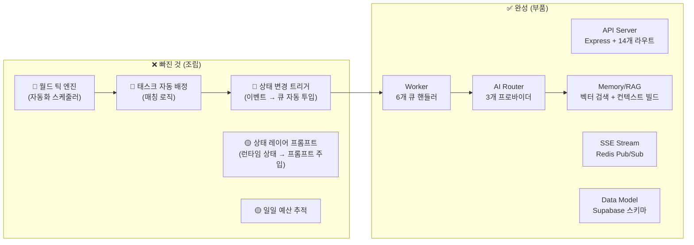

# BLOKS 7가지 핵심 질문 — 코드 기반 심층 분석

> 실제 코드를 전부 읽고 분석한 결과입니다. "있다/없다"가 아니라 **"있는데 왜 안 돌아가느냐"**를 정확히 짚었습니다.

---

## 참고 영상: OpenClaw + DeskRPG

영상의 핵심은 **"AI 에이전트가 가상 오피스 안에서 실시간으로 움직이고, 업무를 수행하고, 결과물을 만들어내는 것이 화면에 보인다"**는 것입니다.

```
사용자(파운더) → 프로젝트/태스크 생성 → AI 캐릭터가 책상에 앉아서 작업
→ 말풍선으로 현재 뭐 하는지 표시 → 결과물 생성 → 리뷰어에게 전달
→ 승인/반려 → 다음 태스크로 이동
```

BLOKS가 목표하는 것과 정확히 같습니다. **그런데 현재 코드에서 이 플로우의 핵심 "심장"이 빠져 있습니다.**

---

## 1. "AI 실행 엔진이 없다"는 게 무슨 말?

### 현재 있는 것 ✅

| 구성요소 | 파일 | 상태 |
|----------|------|------|
| API 키 (OpenAI, Anthropic, Google) | [.env](file:///d:/Projects/BLOKS/.env#L23-L32) | ✅ 3개 다 있음 |
| AI Provider 구현 (OpenAI, Anthropic, Google) | [providers/](file:///d:/Projects/BLOKS/packages/ai-router/src/providers) | ✅ 3개 다 동작 코드 |
| AI Router (`routeAI()`) | [ai-router/index.ts](file:///d:/Projects/BLOKS/packages/ai-router/src/index.ts) | ✅ 모델 선택 + 폴백 + 예산 체크 |
| Worker 핸들러 (`processAiActions`) | [handlers.ts](file:///d:/Projects/BLOKS/apps/worker/src/handlers.ts#L165-L300) | ✅ 태스크 → LLM → 결과 저장 |
| BullMQ Worker | [worker/index.ts](file:///d:/Projects/BLOKS/apps/worker/src/index.ts) | ✅ 6개 큐 리스닝 |

### 없는 것 ❌ — "심장"

```
❌ 아무도 이 파이프라인을 "시작"하는 코드가 없습니다!
```

> [!CAUTION]
> **"AI 실행 엔진이 없다"의 정확한 의미:**
> 코드 부품은 다 있습니다. 근데 **자동차 엔진의 모든 부품이 테이블 위에 놓여 있는 것과, 그것이 조립되어 시동이 걸리는 것은 완전히 다릅니다.**

구체적으로 빠진 것:

```
┌─────────────────────────────────────────────────────────┐
│  1. 태스크가 생성되면 → 자동으로 캐릭터에 배정하는 로직   │  ← 없음
│  2. 배정되면 → 자동으로 BullMQ에 ai-actions Job 넣는 로직 │  ← 없음  
│  3. 주기적으로 월드를 틱하며 → 할일 찾는 스케줄러          │  ← 없음
│  4. 캐릭터가 "일하는 중" → "완료" 상태 변하는 자동 흐름   │  ← 수동만
└─────────────────────────────────────────────────────────┘
```

현재 유일하게 AI를 호출하는 방법은 **`POST /api/v1/jobs`에 직접 JSON을 보내는 것**뿐입니다. 즉, 사람이 curl이나 UI에서 수동으로 "이 캐릭터에게 이 태스크를 AI로 처리하라"고 쏴줘야 합니다.

**OpenClaw/DeskRPG처럼 "파운더가 프로젝트만 던지면 알아서 캐릭터들이 일하는" 자동화 루프가 전혀 없습니다.**

---

## 2. "캐릭터가 Task를 실제 LLM으로 처리" — 왜 안 되냐?

### 코드는 있습니다!

[handlers.ts:processAiActions()](file:///d:/Projects/BLOKS/apps/worker/src/handlers.ts#L165-L300) 을 보면:

```typescript
// 1. 태스크 조회
const task = await sb.from("tasks").select(...).eq("id", taskId).single();

// 2. 캐릭터 페르소나 조회
const character = await sb.from("characters").select("name, code_name, persona_summary")...

// 3. 메모리 RAG 컨텍스트 빌드
const memoryCtx = await buildMemoryContext({ characterId, query: task.title ... });

// 4. 프롬프트 조립
const systemPrompt = `${basePersona}\n\n${memoryCtx.contextBlock}`;

// 5. LLM 호출
const aiResult = await routeAI({ characterId, taskType, prompt, systemPrompt });

// 6. 결과 저장 (artifact + ai_output)
await sb.from("artifacts").insert({ content_markdown: aiResult.output ... });

// 7. 상태 전이 (InProgress → PendingReview)
await sb.from("tasks").update({ state: TaskState.PendingReview ... });
```

> [!IMPORTANT]
> **이 코드 자체는 완벽히 동작할 수 있는 코드입니다!** 문제는 이 함수를 **호출하는 트리거**가 없다는 것.

### 안 되는 이유 3가지

| # | 문제 | 설명 |
|---|------|------|
| 1 | **트리거 없음** | 태스크가 `InProgress`가 되어도, 아무도 자동으로 `ai-actions` 큐에 Job을 넣지 않음 |
| 2 | **Redis/BullMQ 미실행** | Worker가 `redis://localhost:6379`를 기대하지만, Docker Redis가 올라가 있지 않으면 전혀 동작 안 함 |
| 3 | **Supabase 스키마 불일치 가능성** | `memory_nodes`, `character_memory_links`, `match_memories` RPC 등이 Supabase에 실제로 생성되어 있는지 불확실 |

### 필요한 것

```
태스크 상태 변경 (Assigned → InProgress) 
    ↓ 이벤트 감지
    ↓ 자동으로 enqueueJob({ queueName: "ai-actions", payload: { taskId, characterId } })
    ↓ Worker가 processAiActions 실행
    ↓ LLM 호출 → 결과 저장 → 상태 PendingReview로 변경
```

---

## 3. 4-레이어 프롬프트 (페르소나+상태+RAG+지시) — 어떻게?

### 현재 구현 상태

**4레이어 중 3개가 이미 코드에 있습니다:**

| 레이어 | 설명 | 코드 위치 | 상태 |
|--------|------|-----------|------|
| ① 페르소나 | `You are ${character.name} (${character.code_name}). ${character.persona_summary}` | [handlers.ts:202-204](file:///d:/Projects/BLOKS/apps/worker/src/handlers.ts#L202-L204) | ✅ 있음 |
| ② 상태 (런타임) | workload, fatigue, burnout 등 캐릭터 현재 상태 | 미사용 | ❌ **빠짐** |
| ③ RAG (메모리) | `buildMemoryContext()` → 과거 기억 검색해서 컨텍스트 주입 | [context-builder.ts](file:///d:/Projects/BLOKS/packages/memory/src/context-builder.ts) | ✅ 있음 |
| ④ 지시 (태스크) | `Task: ${task.title}\nDescription: ${task.description}\n완료하라` | [handlers.ts:210-214](file:///d:/Projects/BLOKS/apps/worker/src/handlers.ts#L210-L214) | ✅ 있음 |

### 빠진 ② 상태 레이어 — 이렇게 추가하면 됩니다:

```typescript
// 현재 코드 (handlers.ts:202-208)
const basePersona = character?.persona_summary
  ? `You are ${character.name} (${character.code_name}). ${character.persona_summary}`
  : `You are a professional working on a task.`;

const systemPrompt = memoryCtx.contextBlock
  ? `${basePersona}\n\n${memoryCtx.contextBlock}`
  : basePersona;
```

```typescript
// 4-레이어 완전체로 바꾸면:
// ① 페르소나 레이어
const personaLayer = character?.persona_summary
  ? `You are ${character.name} (${character.code_name}). ${character.persona_summary}`
  : `You are a professional.`;

// ② 상태 레이어 (NEW!)
const { data: runtime } = await sb
  .from("character_runtime_states")
  .select("workload_score, fatigue_score, burnout_triggered, activity_status")
  .eq("character_id", characterId)
  .single();

const stateLayer = runtime
  ? `\n현재 상태: 업무량 ${runtime.workload_score}/100, 피로도 ${runtime.fatigue_score}/100` +
    (runtime.burnout_triggered ? ` ⚠️ 번아웃 상태 — 간결하게 응답하라.` : ``) +
    (runtime.activity_status ? `, 현재 활동: ${runtime.activity_status}` : ``)
  : ``;

// ③ RAG 레이어 (이미 있음)
const ragLayer = memoryCtx.contextBlock || ``;

// ④ 지시 레이어 (이미 있음)
const instructionLayer = `Task: ${task.title}\n${task.description}\n완료하라.`;

// 조립
const systemPrompt = [personaLayer, stateLayer, ragLayer].filter(Boolean).join("\n\n");
```

> [!NOTE]
> 상태 레이어를 추가하면 "번아웃 상태인 캐릭터는 짧게 답하고", "여유 있는 캐릭터는 상세하게 답하는" 등의 **캐릭터 성격이 상황에 따라 변하는** 효과를 낼 수 있습니다.

---

## 4. 월드 틱 엔진 — 이게 뭐야?

### 개념

OpenClaw/DeskRPG 같은 서비스에서 **"가상 세계의 시계"**입니다.

```
실제 시간 1분 = 게임 내 1틱
매 틱마다:
  1. 모든 캐릭터의 상태를 업데이트 (피로 증가, 할일 체크)
  2. 대기 중인 태스크가 있으면 → 적합한 캐릭터에 자동 배정
  3. 완료된 태스크 → 다음 단계로 이동 (리뷰 요청 등)
  4. 캐릭터 위치/활동 상태 변경 → 프론트엔드에 브로드캐스트
```

### .env에 설정은 있습니다:

```env
WORLD_TICK_INTERVAL_MS=60000     # 1분마다 틱
WORLD_SNAPSHOT_INTERVAL_MS=3000  # 3초마다 스냅샷
```

### 하지만 실제 틱 엔진은? — ❌ 완전 없음!

현재 `packages/world/src/index.ts`에 있는 건:
- `projectIsoToScreen()` — 아이소메트릭 좌표 변환 유틸
- `shadeRgbColor()` — 색상 유틸

**이건 렌더링 유틸이지 "월드 엔진"이 아닙니다.**

### 월드 틱 엔진이 있어야 하는 것:

```typescript
// 이런 파일이 있어야 합니다: packages/world/src/tick-engine.ts

class WorldTickEngine {
  private intervalMs: number;
  private timer: NodeJS.Timer | null = null;

  async start() {
    this.timer = setInterval(() => this.tick(), this.intervalMs);
  }

  async tick() {
    const tickNumber = ++this.currentTick;
    
    // 1) 모든 캐릭터 상태 업데이트 (피로 증가, 점심시간이면 idle 등)
    await this.updateAllCharacterStates(tickNumber);
    
    // 2) 대기 중인 태스크 → 자동 배정
    await this.autoAssignPendingTasks();
    
    // 3) 배정된 태스크 → ai-actions 큐에 넣기
    await this.dispatchAssignedTasks();
    
    // 4) 오래된 리뷰 → 자동 승인/에스컬레이션
    await this.processStaleReviews();
    
    // 5) 월드 상태 스냅샷 → SSE로 브로드캐스트
    await this.broadcastWorldSnapshot();
  }
}
```

> [!IMPORTANT]
> **월드 틱 엔진 = 위 질문 1번의 "심장"입니다.** 이것이 없으면 캐릭터들이 자동으로 일을 시작할 수 없습니다. OpenClaw/DeskRPG 영상에서 캐릭터들이 "알아서" 움직이는 것이 바로 이 틱 엔진의 역할입니다.

---

## 5. 캐릭터 activity 상태가 실시간 변화

### 인프라는 있습니다 ✅

| 구성요소 | 위치 | 상태 |
|----------|------|------|
| `character_runtime_states` 테이블 | Supabase | ✅ |
| `PATCH /characters/:id/runtime` | [characters.ts:130](file:///d:/Projects/BLOKS/apps/api/src/routes/characters.ts#L130-L186) | ✅ |
| SSE `emitWorldEvent("runtime_update", ...)` | [stream.ts](file:///d:/Projects/BLOKS/apps/api/src/routes/stream.ts) | ✅ |
| Redis Pub/Sub → SSE 브릿지 | [stream.ts:50-76](file:///d:/Projects/BLOKS/apps/api/src/routes/stream.ts#L50-L76) | ✅ |
| Worker에서 `publishWorldEvent("runtime_update", ...)` | [handlers.ts:469-476](file:///d:/Projects/BLOKS/apps/worker/src/handlers.ts#L469-L476) | ✅ |

### 빠진 것

```
❌ "상태를 자동으로 변경하는 주체"가 없음
```

현재 상태가 변하려면:
- 누군가 `PATCH /characters/:id/runtime`을 호출하거나
- Worker의 `analytics-rollups` 핸들러가 실행되어야 하는데, 이것도 수동으로 Job을 넣어야 실행됨

**실시간 변화가 일어나려면 → 월드 틱 엔진이 매 틱마다 캐릭터 상태를 갱신해줘야 합니다 (4번과 연결)**

---

## 6. AI Router 껍데기만 있다?

### ❌ 아닙니다! AI Router는 거의 완성입니다!

이전 분석이 잘못되었습니다. 실제 코드를 보면:

| 기능 | 상태 | 코드 |
|------|------|------|
| `routeAI()` 함수 | ✅ **완전 구현** | 캐릭터 모델 프로필 조회 → 모델 선택 → 프로바이더 라우팅 → 실행 → 폴백 |
| OpenAI 프로바이더 | ✅ **완전 구현** | `chat.completions.create()` 호출, 비용 추정, 에러 핸들링 |
| Anthropic 프로바이더 | ✅ **구현됨** | [anthropic.ts](file:///d:/Projects/BLOKS/packages/ai-router/src/providers/anthropic.ts) |
| Google 프로바이더 | ✅ **구현됨** | [google.ts](file:///d:/Projects/BLOKS/packages/ai-router/src/providers/google.ts) |
| 예산 가드 | ✅ | `AI_MAX_COST_PER_TASK_USD=0.50` 체크 |
| 폴백 로직 | ✅ | 실패 시 gpt-4o-mini로 폴백 |
| 캐릭터별 모델 조회 | ✅ | `fetchCharacterModelProfile(characterId)` → Supabase |

> [!TIP]
> AI Router는 **"껍데기만"이 아니라 거의 production-ready**입니다. 단지 **호출되는 경로(트리거)가 수동**이라서 "안 돌아가는 것처럼 보이는" 것입니다.

---

## 7. 캐릭터별 모델 배정, 예산 적용

### 모델 배정 ✅

[ai-router/index.ts:76-110](file:///d:/Projects/BLOKS/packages/ai-router/src/index.ts#L76-L110):

```typescript
// 1. Supabase에서 캐릭터의 model_profile을 조회
async function fetchCharacterModelProfile(characterId: string) {
  const { data } = await sb
    .from("characters")
    .select("model_profiles!default_model_profile_id(model_id, provider_name)")
    .eq("id", characterId)
    .single();
  // ...
}

// 2. 캐릭터 프로필에 모델이 지정되어 있으면 그것 사용, 아니면 태스크 타입 기본값
function selectModel(taskType, profile) {
  if (profile?.model_id) return profile.model_id;  // 캐릭터별 모델!
  return TASK_MODEL_MAP[taskType] ?? "gpt-4o-mini"; // 기본값
}
```

태스크 타입별 기본 모델:
```
planningDocument  → gpt-4o
prd_draft         → gpt-4o  
research_summary  → gpt-4o
marketing_copy    → gpt-4o-mini (저비용)
approval_analysis → gpt-4o-mini
character_action  → gpt-4o-mini
```

### 예산 적용 ✅

```typescript
// .env
AI_MAX_COST_PER_TASK_USD=0.50    // 태스크당 최대
AI_DAILY_BUDGET_USD=20.00        // 일일 예산 (⚠️ 체크 로직은 미구현)

// 코드에서 pre-flight 비용 체크
if (estimatedInputCost(model, fullPromptLength) > MAX_COST_USD) {
  throw new Error("AI_BUDGET_EXCEEDED");
}
```

> [!WARNING]
> **태스크당 예산은 동작하지만, 일일 예산(`AI_DAILY_BUDGET_USD`)을 누적 추적하는 로직은 없습니다.** 현재는 개별 태스크의 예상 입력 비용만 체크합니다.

### 미완성 부분

- `model_profiles` 테이블에 캐릭터별 모델을 시딩해야 함 (현재 Supabase에 데이터가 있는지 불확실)
- 일일 예산 누적 추적 미구현
- Anthropic/Google 프로바이더의 비용 추정 정확도 미검증

---

## 종합: 현재 상태 정리



---

## 핵심 결론: 뭘 만들어야 하나?

**1개의 핵심 파일만 만들면 전체가 살아납니다:**

### `packages/world/src/tick-engine.ts` — 월드 틱 엔진

이것이 하는 일:
1. **매 60초마다** (설정 가능) 월드를 "틱"
2. 틱마다:
   - 대기 중 태스크 → 적합한 캐릭터에 자동 배정
   - 배정된 태스크 → `ai-actions` 큐에 Job 투입
   - 캐릭터 상태(피로, 워크로드) 자동 갱신
   - 오래된 리뷰 → 에스컬레이션
   - 전체 상태 → SSE로 브로드캐스트

**이 하나가 구현되면:**
- ✅ AI 실행 엔진이 돌아감 (질문 1)
- ✅ 캐릭터가 자동으로 LLM으로 태스크 처리 (질문 2)
- ✅ 상태 레이어 프롬프트 추가 가능 (질문 3)
- ✅ 월드 틱 엔진 완성 (질문 4)
- ✅ 캐릭터 activity 실시간 변화 (질문 5)
- ✅ AI Router가 실제로 호출됨 (질문 6)
- ✅ 캐릭터별 모델이 실전 적용 (질문 7)

> [!IMPORTANT]
> **만들까요?** 월드 틱 엔진 + 태스크 자동 배정 + 상태 레이어 프롬프트 추가 — 이 3가지를 한 번에 구현하면 BLOKS가 OpenClaw/DeskRPG처럼 "캐릭터들이 알아서 일하는" 상태가 됩니다.
