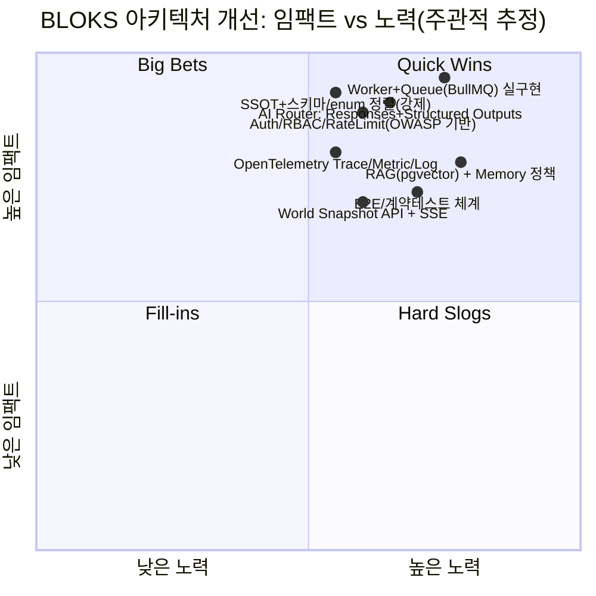
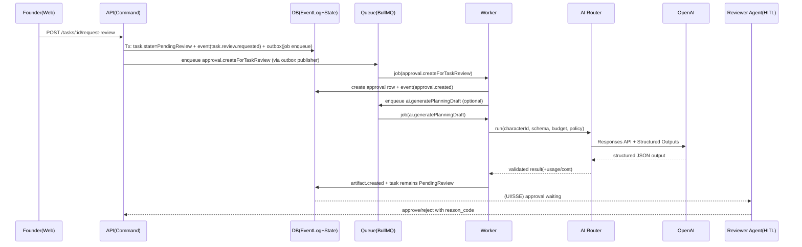

> ⚠️ **[ARCHIVED 2026-05-21]** 구현 완료 — 더 이상 업데이트하지 않습니다.

# BLOKS 멀티에이전트 “회사형 OS” 아키텍처 심층 리서치 및 설계 개선 권고서

## Executive Summary

BLOKS 리포지토리(wsung2023/BLOKS)는 **문서(00~13번 Build-Spec)**가 매우 촘촘하고(특히 API/Job 계약, 월드 런타임 규칙, SSOT 정본 선언), 실제 구현도 **모노레포/웹 UI 셸/일부 API 라우트/seed/ai-router 골격**까지는 올라와 있습니다. fileciteturn96file0L1-L1 fileciteturn99file0L1-L1 fileciteturn90file0L1-L1 fileciteturn91file0L1-L1 fileciteturn92file0L1-L1  
하지만 “AI 에이전트 회사”를 **운영 가능한 시스템**으로 만들기 위해 필요한 핵심이 아직 비어 있거나(Worker/Queue 실동작), 서로 어긋나 있습니다(스키마/이벤트 로그/엔진 경계/모델 정책). fileciteturn28file0L1-L1 fileciteturn94file0L1-L1 fileciteturn92file0L1-L1

가장 중요한 결론은 하나입니다.

**“BLOKS는 지금 ‘설계 문서 기반의 UI/CRUD 스텁’ 단계다. 다음 단계는 ‘SSOT(단일 진실원천) + Durable Orchestration(내구성 있는 작업 실행) + 관측가능성/보안’으로 제품의 심장을 박는 일이다.”**

우선순위 권고(핵심만, H/M/L):

- **H: SSOT 강제(스키마/이벤트/상태머신/ID/enum 정렬) + 엔진 경계 도입**: 현재 API 라우트가 전이 규칙을 직접 들고 있고(Task transitions), 문서의 “engine이 최종 책임” 구조가 코드로 강제되지 않습니다. fileciteturn46file0L1-L1 fileciteturn89file0L1-L1 fileciteturn99file0L1-L1  
- **H: Worker/Queue 실구현(BullMQ 또는 Temporal급 내구성) + Outbox 패턴**: 문서는 BullMQ/비동기 Job을 강하게 전제하지만, worker는 현재 스텁이며 큐는 “폴더 존재” 수준으로 진행률이 계산됩니다. fileciteturn28file0L1-L1 fileciteturn100file0L1-L1  
- **H: AI Router를 Responses API + Structured Outputs 기반으로 재정렬**: 문서는 Responses API/Structured Outputs를 권장하지만, 실제 구현은 Chat Completions JSON mode 성격(response_format json_object) 중심입니다. fileciteturn99file0L1-L1 fileciteturn23file0L1-L1 citeturn2search1turn2search2turn0search2  
- **H: 보안(인증/권한/비밀키/레이트리밋/SSRF/리소스 과소비) 체계화**: dev-bypass 토큰과 단순 JWT 로직이 남아 있고, Supabase 서비스 키 사용은 “절대 브라우저 노출 금지” 류의 사고를 만드는 지점입니다. fileciteturn30file0L1-L1 fileciteturn67file0L1-L1 fileciteturn41file0L1-L1 citeturn1search3turn0search4  
- **H: 관측가능성(Tracing/Logs/Metrics) + 상관관계 ID 표준화**: 에이전트/잡/이벤트가 분산되면 디버깅이 “감”이 아니라 “추적”이어야 합니다. W3C Trace Context + OpenTelemetry가 표준 선택입니다. citeturn4search3turn3search2turn3search5  

중요한 설계 철학(문서의 강점을 살리는 방향):

- 08/10 문서가 말하는 것처럼, **월드는 ‘진실 원장’이 아니라 ‘Read Model 소비자’**여야 하고, 서버의 truth는 Event Log/DB에 있어야 합니다. fileciteturn89file0L1-L1 fileciteturn91file0L1-L1  
- 11번 정본 선언(SSOT “대법원”)을 실제로 **컴파일/테스트가 강제하는 규칙**으로 바꿔야 합니다. 지금은 선언은 강하지만, 코드가 이를 자동으로 깨도 알아차리기 어렵습니다. fileciteturn92file0L1-L1 fileciteturn100file0L1-L1  

(전제/미정) 클라우드/배포(K8s 여부), 목표 트래픽/동시 사용자, 멀티테넌시, 데이터 민감도(PII 포함 여부), 에이전트 자율성 수준(항상 On vs On-demand)은 리포지토리에서 명시가 제한적이어서 **미정으로 두고** 설계를 제안합니다. fileciteturn89file0L1-L1 fileciteturn99file0L1-L1  

## 저장소 기반 현행 아키텍처와 컴포넌트 역할

### 모노레포/런타임 구성

BLOKS는 pnpm workspace 기반 모노레포이며, `apps/*`와 `packages/*`를 포함합니다. fileciteturn11file0L1-L1  
루트는 turborepo를 사용하고, 개발/빌드 스크립트가 정의되어 있습니다. fileciteturn12file0L1-L1 fileciteturn13file0L1-L1  

현재 코드베이스에서 확인되는 핵심 앱/패키지:

- `apps/web`: Next.js 15/React 19 기반 UI(월드/승인/프롬프트/애널리틱스 등). fileciteturn26file0L1-L1 fileciteturn70file0L1-L1  
- `apps/api`: Express 기반 REST API 서버(프로젝트/태스크/승인/캐릭터/이벤트/잡 등 라우트). fileciteturn25file0L1-L1 fileciteturn29file0L1-L1  
- `apps/worker`: 현재는 “worker running”만 찍는 스텁. fileciteturn27file0L1-L1 fileciteturn28file0L1-L1  
- `packages/shared`: enum/ID prefix/상태전이 상수(TASK_TRANSITIONS 등). fileciteturn43file0L1-L1 fileciteturn49file0L1-L1 fileciteturn45file0L1-L1  
- `packages/db`: Supabase 클라이언트(서비스 키/anon) 기반 접근 + Prisma 스키마 폴더(향후/SSOT 후보). fileciteturn40file0L1-L1 fileciteturn41file0L1-L1 fileciteturn35file0L1-L1  
- `packages/ai-router`: OpenAI/Anthropic 공급자 어댑터 + Supabase에서 캐릭터/모델 프로필 조회하는 라우팅 흐름(부분). fileciteturn18file0L1-L1 fileciteturn22file0L1-L1 fileciteturn23file0L1-L1  
- `packages/world`, `packages/simulation`: 월드/시뮬레이션 레이어의 최소 골격(현재 export/구현 불완전 징후). fileciteturn58file0L1-L1 fileciteturn60file0L1-L1  

### 현재 “에이전트 회사” 모델의 구현 흔적

BLOKS는 사람 사용자(Founder) + 40 roster 에이전트(Active Core/On-call/Specialist)를 전제로 한 **“회사형 멀티에이전트”** 개념을 문서로 명확히 고정합니다. fileciteturn97file0L1-L1 fileciteturn92file0L1-L1  
실제 seed에는 Founder/Digital Twin/임원/기획 등 캐릭터 정의가 상당히 자세히 들어 있습니다(페르소나, core_drive, moral_filter, 기본 모델 프로필 등). fileciteturn103file0L1-L1  

다만 현재 런타임 상 “에이전트가 실제로 일을 수행하는 엔진/워커”는 아직 비어 있습니다(워커 스텁, 잡 큐 미구현). fileciteturn28file0L1-L1  

### As-is 아키텍처 다이어그램

```mermaid
flowchart LR
  U[Founder (Web UI)] -->|HTTP| WEB[apps/web (Next.js)]
  WEB -->|REST + dev-bypass header| API[apps/api (Express)]
  API -->|DB client| DB[(Supabase/Postgres)]
  API -->|writes| EVT[(event_logs?)]
  API -->|reads| SNAP[(character_runtime_state?)]
  API -->|calls (partial)| AIR[packages/ai-router]
  AIR -->|Chat Completions| OAI[(OpenAI API)]
  WKR[apps/worker (stub)] -.->|not wired yet| Q[(Queue/Redis)]
```

근거: web의 API 호출/토큰 주입 패턴, API의 Express 라우트 구성, ai-router의 OpenAI 호출 구현이 코드로 확인됩니다. fileciteturn67file0L1-L1 fileciteturn29file0L1-L1 fileciteturn23file0L1-L1  

## 최우선 이슈 맵

현재 BLOKS의 설계/구현 완성도를 가로막는 “상위 5개 병목”은 아래입니다.

1) **정본(SSOT) 선언은 강하지만, 코드가 강제하지 않는다**  
11번 문서는 SSOT/queue 명/ID prefix/실시간 모델/Provider 정책을 “대법원 판례”로 선언합니다. fileciteturn92file0L1-L1  
그런데 실제로는 seed/DB/API/프론트가 서로 다른 필드/enum을 기대하는 흔적이 있어, “문서만 읽으면 완벽”이 “실제 런타임에서는 어긋남”으로 바뀌기 쉽습니다(예: 프론트 world canvas가 runtime_status/current_task_count를 기대). fileciteturn62file0L1-L1  

2) **Durable execution(내구성 있는 실행)이 아직 없다**  
설계는 “API는 job enqueue, worker가 장기 작업/AI 수행”을 전제로 합니다. fileciteturn90file0L1-L1 fileciteturn89file0L1-L1  
그러나 worker는 스텁이며, BullMQ/Redis는 문서에만 강하게 존재합니다. fileciteturn28file0L1-L1 citeturn0search0  

3) **AI 출력 신뢰성(Structured Outputs)과 비용/정책 통제가 목표 대비 약하다**  
OpenAI는 JSON mode보다 한 단계 강한 “Structured Outputs(스키마 준수)”를 제공하며, agentic workflow의 신뢰성을 높이려면 이를 쓰는 게 정석에 가깝습니다. citeturn0search2turn2search2  
하지만 현재 ai-router는 `response_format: { type: "json_object" }` 중심이며(스키마 강제 아님), 문서가 의도하는 “스키마/재시도/폴백/예산”이 코드로 강제되는 수준은 아직 제한적입니다. fileciteturn23file0L1-L1 fileciteturn90file0L1-L1  

4) **보안/권한/프라이버시가 MVP 가드레일 수준에 머무름**  
OWASP API Security Top 10(2023)은 API 보안에서 권한/인증/리소스 과소비가 핵심 위험임을 강조합니다. citeturn1search3  
현재 auth 미들웨어와 web의 dev-bypass 패턴은 개발 속도에는 좋지만, 운영 단계로 넘어가면 즉시 “부채 폭탄”이 됩니다. fileciteturn30file0L1-L1 fileciteturn67file0L1-L1  

5) **관측가능성(Observability) 부재 → 에이전트/잡 디버깅이 불가능해질 위험**  
분산 시스템에서 트레이싱 표준은 W3C Trace Context(HTTP 헤더 표준화)이며, OpenTelemetry가 이를 준수해 추적을 연결합니다. citeturn4search3turn3search2  
멀티에이전트/멀티잡 환경에서 “왜 이 승인/반려가 일어났는지”를 UI에 설명하려면, 처음부터 trace/job/event 상관관계를 설계해야 합니다. fileciteturn88file0L1-L1  

### 임팩트-노력 매트릭스(상위 이니셔티브)



## 차원별 설계 개선 권고안

아래 13개 차원은 요청하신 항목을 **모두 명시적으로** 다룹니다. 각 차원마다 (1) 이슈/갭, (2) 설계 변경, (3) 구현 단계+우선순위, (4) 노력/복잡도, (5) 예시(코드/다이어그램)를 제공합니다.

### 현재 아키텍처와 컴포넌트 역할

(1) 이슈/갭  
문서(07~10)는 web/api/worker/ai-router 간 역할 분리를 매우 명확히 요구하지만, 실제 구현은 **API가 “큐/워커 없는 상태”를 전제로 한 라우트 스텁**이 많고, worker는 실행/재시도/후처리 책임이 비어 있습니다. fileciteturn99file0L1-L1 fileciteturn89file0L1-L1 fileciteturn28file0L1-L1  

(2) 설계 변경(권고)  
“역할”을 코드 구조로 강제하세요.

- `apps/api`: **Command API(상태 변경 요청 수신)** + **Read API(조회/프로젝션)**로 명확히 분리  
- `apps/worker`: **Job 실행 + AI 호출 + 후처리 + 이벤트/프로젝션 갱신**을 전담  
- `packages/engine`(또는 동등 계층): 상태전이/권한/가드레일을 **import로 강제**(라우트에 규칙 하드코딩 금지) — 문서 08/07이 의도한 경계입니다. fileciteturn89file0L1-L1  

(3) 구현 단계/우선순위  
- **H**: API 라우트(특히 task 상태 전이)에서 shared 상수 직접 참조를 제거하고, “engine 함수를 단일 진입점”으로 만들기 fileciteturn46file0L1-L1  
- **M**: Read model(월드/보드/애널리틱스)을 위한 projection 모듈 도입(별도 테이블/뷰/캐시)

(4) 노력/복잡도: **중~상** (하지만 여기부터 박아야 이후 모든 기능이 빨라집니다)

(5) 예시  
엔진 경계를 위한 최소 인터페이스(개념):

```ts
// packages/engine/src/transitionTask.ts (예시)
export type TransitionRequest = {
  taskId: string;
  actorCharacterId: string; // or system
  to: "Assigned" | "Accepted" | "InProgress" | "PendingReview" | "Rejected" | "Rework" | "Approved" | "Done" | "Blocked";
  reasonCode?: string;
  comment?: string;
};

export type TransitionResult =
  | { ok: true; events: Array<{ type: string; payload: any }>; followupJobs: Array<{ queue: string; name: string; data: any }> }
  | { ok: false; errorCode: string; message: string };
```

---

### 에이전트 타입과 책임(Agent types & Responsibilities)

(1) 이슈/갭  
로스터/seed는 페르소나가 매우 풍부하지만, “업무 실행 책임”이 현재는 시스템적으로 분해되어 있지 않아 **캐릭터 설정이 곧바로 ‘행동 정책(policy)’으로 연결되지 않습니다.** fileciteturn75file0L1-L1 fileciteturn103file0L1-L1  
또한 11번 문서는 MVP에서 Provider를 OpenAI 단일로 강제하라고 하지만, seed에는 여러 모델 프로필이 섞여 있고(ai-router 패키지도 Anthropic 의존성을 포함), 정책-코드 정렬이 약합니다. fileciteturn92file0L1-L1 fileciteturn18file0L1-L1  

(2) 설계 변경(권고)  
“캐릭터 = LLM 호출자”가 아니라, **캐릭터 = (역할) + (권한) + (정책) + (도구 접근) + (산출물 계약)** 으로 모델링하세요.

- Agent를 최소 4유형으로 분류(권고):
  - **Orchestrator/Manager**: 작업 분해·배정·후속 job 생성(LLM 호출은 하더라도 결과 확정권 없음)
  - **Specialist Producer**: 산출물 생성(PRD/리서치/마케팅/코드)
  - **Reviewer/QA**: 검토 체크리스트 기반 평가/반려(reason code)
  - **Governor**: 정책/예산/위험 승급, 인간 승인(HITL) 요구 플래그 생성

(3) 구현 단계/우선순위  
- **H**: `character_policy`(또는 `agent_profile`) 테이블/스키마를 만들고, ai-router 입력에 **policy(tool/budget/schema/allow_web)**를 강제(문서 09 계약과 동일) fileciteturn90file0L1-L1  
- **M**: “Active Core만 항상 on”이라는 문서 원칙을 코드로 강제(월드 렌더/스케줄러/잡 생성에서) fileciteturn97file0L1-L1 fileciteturn91file0L1-L1  

(4) 노력/복잡도: **중**

(5) 예시(에이전트 상호작용 다이어그램은 아래 ‘에이전트 간 통신’ 절에 포함)

---

### 에이전트 간 통신 프로토콜(Inter-agent communication)

(1) 이슈/갭  
현재 코드에서 에이전트 간 통신은 사실상 구현되어 있지 않고, “이벤트 로그/잡”도 스키마-일관성이 약합니다(예: 이벤트 insert가 서로 다른 필드를 기대). fileciteturn47file0L1-L1 fileciteturn54file0L1-L1  
또한 Redis Pub/Sub는 **at-most-once**라 메시지 유실 가능성이 있어 “업무 실행 경로” 통신으로는 부적합합니다(문서도 Pub/Sub 단독을 경계하는 맥락과 일치). citeturn0search1 fileciteturn99file0L1-L1  

(2) 설계 변경(권고)  
통신을 2층으로 나누세요.

- **업무 실행(신뢰 필요)**: Queue(BullMQ) + DB(outbox/event log) 기반 **at-least-once**  
- **UI 반영(실시간 느낌)**: SSE/WebSocket + (유실 허용) 폴링 보완 — 11번 정본의 “2~5초 snapshot + 중요 이벤트 push”를 코드로 구현 fileciteturn92file0L1-L1  

(3) 구현 단계/우선순위  
- **H**: EventLog 스키마를 “append-only”로 고정하고, 모든 상태 변경은 트랜잭션 내 **EventLog + Outbox 레코드**를 같이 남기기(Outbox는 worker가 queue publish)  
- **M**: 이벤트 명명 규칙을 09 문서로 고정하고, 타입을 packages/shared에서 SSOT로 제공 fileciteturn90file0L1-L1 fileciteturn43file0L1-L1  

(4) 노력/복잡도: **상**

(5) 예시(에이전트 상호작용 다이어그램)



---

### 데이터 흐름 및 저장(Data flow & Storage)

(1) 이슈/갭  
문서상 “PostgreSQL + Prisma + pgvector(기억/RAG)”를 강하게 의도하지만, 현재 DB 접근은 Supabase 클라이언트로 구현되어 있고(서비스 키/anon), Prisma 스키마는 폴더 구성만 일부 갖춘 상태입니다. fileciteturn99file0L1-L1 fileciteturn41file0L1-L1 fileciteturn35file0L1-L1  
Prisma의 schema folder 기능(`prismaSchemaFolder`)은 공식적으로 GA 상태이긴 하지만, **어떤 파일이 정본인지/마이그레이션 생성이 단일화되는지** 운영 규칙이 필요합니다. citeturn1search8  

(2) 설계 변경(권고)  
- “DB는 하나의 Postgres”로 두되, 선택지는 2개입니다:
  - **A안(권고, 단순)**: Supabase(Postgres)를 그대로 쓰면서도, **Prisma를 SSOT(스키마/마이그레이션/타입생성)**로 삼고 API/worker는 Prisma Client로 접근(브라우저는 RLS로 제한)  
  - **B안**: Supabase를 빠지고 “순수 Postgres + Prisma + 별도 Auth”로 간다(운영 자유도↑, 초기 작업↑)

(3) 구현 단계/우선순위  
- **H**: “스키마 정본”을 Prisma로 고정하고, Supabase 테이블 구조와 1:1로 맞춘 뒤 seed/코드/문서의 필드명을 강제 정렬  
- **M**: Artifact 원문(대형 텍스트)은 DB에 직접 저장해도 되지만, 장기적으로는 object storage(S3 등) + DB pointer 구조 고려(비용/성능) — 07 문서의 “AI 원문 무제한 저장 금지” 원칙과 동일 fileciteturn99file0L1-L1  

(4) 노력/복잡도: **상**

(5) 예시(Outbox 포함 최소 테이블 개념)
- `event_log(id, type, entity_type, entity_id, actor_id, payload_json, occurred_at)`
- `outbox(id, topic, payload_json, status, created_at)` → worker가 publish 후 status=sent

---

### 상태 관리(State management)

(1) 이슈/갭  
문서는 Event Log를 진실 원장으로 삼고, 스냅샷/프로젝션으로 월드/보드를 보여주는 구조를 명확히 합니다. fileciteturn89file0L1-L1 fileciteturn91file0L1-L1  
그러나 현재 구현은 “상태 테이블을 직접 갱신 + 이벤트 로그는 부분적으로만 기록 + 필드 불일치 가능성” 패턴에 가깝습니다. fileciteturn47file0L1-L1 fileciteturn54file0L1-L1  

(2) 설계 변경(권고)  
상태 관리를 3계층으로 정리하세요.

- **Write model**: Project/Task/Approval/CharacterRuntimeState (정규화)  
- **Event Log**: append-only (감사/재현/프로젝션 기반)  
- **Read model**: WorldSnapshot/KanbanView/AnalyticsRollup (조회 최적화)

또한 장기 실행/멀티스텝 에이전트 워크플로우는 “체크포인트/재시작(resume)”이 핵심인데, LangGraph는 **super-step 단위 checkpoint**로 이를 지원합니다(개념 참조용으로 가치 큼). citeturn4search0  

(3) 구현 단계/우선순위  
- **H**: Task/Approval 상태 전이 = `engine.transitionX()`가 events + followupJobs를 반환하고, API가 트랜잭션으로 반영  
- **M**: 월드/보드용 read model은 “이벤트 기반 프로젝션” + “주기적 재생성(백업)” 혼합

(4) 노력/복잡도: **상**

(5) 예시(프로젝션 워커 개념)
```ts
// worker: event -> projection update (예시 개념)
onEvent("task.state.changed", (evt) => updateKanbanProjection(evt));
onEvent("character.status.changed", (evt) => updateWorldSnapshot(evt));
```

---

### 오케스트레이션 및 스케줄링(Orchestration & Scheduling)

(1) 이슈/갭  
문서 07/09는 BullMQ+Worker를 전제로 Job taxonomy와 retry 규칙까지 정의합니다. fileciteturn99file0L1-L1 fileciteturn90file0L1-L1  
하지만 worker/queue가 실구현되어 있지 않으면, BLOKS는 ‘회사형 UI’는 되어도 ‘회사형 자동 실행’이 되지 않습니다. fileciteturn28file0L1-L1  

(2) 설계 변경(권고)  
- BullMQ를 계속 간다면, “단일 job”이 아니라 **Flow(부모-자식 트리)**로 멀티스텝 워크플로우를 구현하세요. BullMQ는 FlowProducer로 parent-child job과 의존성을 지원합니다. citeturn0search0  
- “실패 시 즉시 부모 처리”가 필요한 흐름은 `continueParentOnFailure`를 고려할 수 있습니다(예: child 실패 시 cleanup/rollback). citeturn0search3  

(3) 구현 단계/우선순위  
- **H**: 09 문서 기준 큐 이름 고정(11번 정본) + `job envelope`(idempotency 포함) 강제 fileciteturn92file0L1-L1 fileciteturn90file0L1-L1  
- **H**: 첫 end-to-end job(예: `ai.generatePlanningDraft`)만이라도 “enqueue → worker → ai-router → artifact 저장 → event log” 완주시키기  
- **M**: 주기 작업(analytics rollup, approval expiry scan)은 BullMQ repeatable jobs 또는 별도 scheduler로 분리

(4) 노력/복잡도: **상**

(5) 예시(BullMQ FlowProducer)

```ts
import { FlowProducer } from "bullmq";

const flowProducer = new FlowProducer({ connection: { host: "localhost", port: 6379 } });

await flowProducer.add({
  name: "task-review-flow",
  queueName: "workflow-transitions",
  data: { taskId: "task_101" },
  children: [
    { name: "approval.createForTaskReview", queueName: "approvals", data: { taskId: "task_101" } },
    { name: "ai.generatePlanningDraft", queueName: "ai-actions", data: { taskId: "task_101", schema: "PlanningDraftV1" } },
  ],
});
```
(Flow 개념/인터페이스는 BullMQ 공식 문서에 근거) citeturn0search0  

---

### 확장성 및 성능(Scalability & Performance)

(1) 이슈/갭  
월드 렌더링은 Pixi로 구성되어 있고, 월드가 “실시간처럼 보이되 실제는 snapshot 기반”이어야 한다는 문서 원칙이 명확합니다. fileciteturn62file0L1-L1 fileciteturn91file0L1-L1  
다만 현재는 polling/렌더 사이의 경계(스냅샷 주기/이벤트 push/보간)가 완전히 정착된 흔적은 제한적입니다(11번은 2~5초 snapshot+push 정본). fileciteturn92file0L1-L1  

(2) 설계 변경(권고)  
- World Snapshot은 “항상 전체를 보내는 API”가 아니라:
  - **초기 로드: full snapshot**
  - **이후: delta events + 주기 snapshot(백업)**  
- 캐릭터 수/이펙트 수/픽시 스프라이트 로딩을 “Active Core 우선”으로 강제(문서도 이걸 강하게 권장). fileciteturn91file0L1-L1  

(3) 구현 단계/우선순위  
- **H**: `/world/snapshot`(read model) + `/world/events/stream`(SSE) 추가(07 문서에도 존재) fileciteturn99file0L1-L1  
- **M**: API caching(ETag/If-None-Match) + DB 인덱스(특히 event_log cursor pagination)

(4) 노력/복잡도: **중**

(5) 예시(SSE 개념)
```ts
// API: GET /world/events/stream -> text/event-stream
// client: EventSource로 subscribe 후, Pixi state delta 적용
```

---

### 장애 허용(Fault tolerance) 및 관측가능성(Observability)

(1) 이슈/갭  
분산 잡/에이전트 시스템에서 가장 무서운 실패는 “조용히 틀린 상태”입니다. 지금은 job/agent/trace 상관관계 키가 일관되게 강제되지 않습니다.

(2) 설계 변경(권고)  
- **Tracing 표준화**: W3C Trace Context(`traceparent`, `tracestate`)를 서비스 간 전달하도록 표준화하세요. citeturn4search3  
- **OpenTelemetry 도입**: SpanContext/trace-id를 표준 형태로 관리하고, API/worker/ai-router/OpenAI 호출을 하나의 trace로 묶습니다. citeturn3search2turn3search5  
- AI 호출은 반드시 다음 메타를 남기세요: `model`, `tokens in/out`, `latency`, `estimated cost`, `schema validation result`

(3) 구현 단계/우선순위  
- **H**: API → worker로 job enqueue 시 `traceparent`를 job envelope에 포함  
- **H**: 실패 분류(Timeout/SchemaInvalid/BudgetExceeded/PolicyViolation)와 재시도 정책을 코드로 강제(09 문서 근거) fileciteturn90file0L1-L1  
- **M**: 대시보드 최소 지표(문서 07 제안): failed jobs, stuck approvals, blocked tasks, top costly tasks fileciteturn99file0L1-L1  

(4) 노력/복잡도: **중~상**

(5) 예시(Trace Context를 job에 실어 보내기)
```ts
type JobEnvelope = {
  jobId: string;
  jobType: string;
  traceparent?: string; // W3C Trace Context
  requestedBy: "founder" | "system";
  payload: unknown;
};
```
(W3C Trace Context는 분산 추적을 위한 표준 헤더를 정의) citeturn4search3  

---

### 보안 및 프라이버시(Security & Privacy)

(1) 이슈/갭  
- API 보안의 대표 위험은 “깨진 권한/인증/리소스 과소비”이며, OWASP API Security Top 10이 이를 체계화합니다. citeturn1search3  
- Supabase는 RLS를 권장하며, Service key는 RLS를 우회할 수 있으므로 브라우저 노출 금지를 명시합니다. citeturn0search4  
- 현재 코드에는 dev-bypass 토큰/헤더 주입이 존재합니다. fileciteturn30file0L1-L1 fileciteturn67file0L1-L1  

또한 한국 정부/KISA는 2025년 ‘인공지능(AI) 보안 안내서’를 배포하며, 개발자/서비스 제공자/이용자 관점에서 **보안 3대 요소(CIA) 기반 요구사항 113개**를 제시했다고 밝혔습니다. citeturn14search0turn16view0  

(2) 설계 변경(권고)  
- “Founder 단일 계정 MVP”라 해도, 최소한 아래는 즉시 도입해도 비용 대비 효과가 큽니다:
  - **인증**: dev-bypass 제거(환경 분기) + 토큰 검증(issuer/audience/exp)  
  - **권한**: 04-01 권한/승인 매트릭스를 “코드 정책”으로 강제(엔진에서 검사) fileciteturn78file0L1-L1  
  - **Rate limit/비용 폭주 방어**: API4:2023 “Unrestricted Resource Consumption” 대응(레이트리밋, 동시 잡 제한, 입력 크기 제한). citeturn1search3  
  - **SSRF/외부 호출 정책**: 웹 검색/URL fetch tool 도입 시 SSRF 방어(API7:2023) citeturn1search3  
  - **비밀키 관리**: service_role 키는 서버 전용 + 권한 최소화 + rotate

(3) 구현 단계/우선순위  
- **H**: dev-bypass 제거 + 환경변수 스키마 검증(08 문서가 이미 제안) fileciteturn89file0L1-L1  
- **H**: 엔드포인트별 권한(Founder override 포함) + audit log(결재/반려)  
- **M**: 인공지능 보안 안내서(과기정통부/KISA)의 체크리스트를 DevSecOps gate로 편입(릴리즈 전 체크) citeturn14search0turn16view0  

(4) 노력/복잡도: **중**

(5) 예시(“보호가 필요한 business flow” 레이트리밋)
- POST /ai-actions, POST /tasks/:id/transition 같은 “민감 플로우”는 IP/사용자 단위 rate limit + idempotency 필수

---

### 테스트/검증(Testing & Validation)

(1) 이슈/갭  
진행률 도구(spec-progress)는 “파일 존재/패턴 포함”을 기준으로 체크합니다. 즉 “보드 페이지가 존재한다”는 사실이 “보드가 동작한다”를 의미하지 않습니다. fileciteturn100file0L1-L1  
실제로 board 페이지는 코드가 깨져 보이는 흔적이 있어, smoke test가 없으면 퀄리티가 급락합니다. fileciteturn71file0L1-L1  

(2) 설계 변경(권고)  
테스트를 3단으로 설계하세요.

- **엔진/전이 규칙 unit test**: 상태전이 허용/금지, reason code 필수성  
- **API contract test**: 09의 `ok/data` 응답 규격을 자동 검증 fileciteturn90file0L1-L1  
- **E2E smoke(Playwright)**: world/approvals/board 핵심 플로우 최소 3개

(3) 구현 단계/우선순위  
- **H**: “상태전이 테스트” 하나만이라도 먼저(가장 ROI 큼)  
- **M**: PR마다 API+web smoke test가 돌아가게 CI에 묶기

(4) 노력/복잡도: **중**

(5) 예시(전이 테스트 개념)
```ts
expect(transition({ from:"Assigned", to:"Accepted" })).toBeOk();
expect(transition({ from:"Done", to:"InProgress" })).toBeError("TASK_INVALID_TRANSITION");
```

---

### 배포/CI-CD(Deployment & CI/CD)

(1) 이슈/갭  
모노레포/터보/워크스페이스는 갖춰졌지만, “배포 파이프라인/환경 분리(dev/stg/prod)/시크릿 주입”이 리포지토리에 고정돼 있지는 않습니다. fileciteturn13file0L1-L1 fileciteturn12file0L1-L1  

(2) 설계 변경(권고)  
- GitHub Actions(필수): lint/test/build + turborepo 캐시  
- 배포는 미정이지만, 최소한 **컨테이너 단위**로 web/api/worker를 분리해 배포할 수 있게 하세요(운영/스케일 단순화)

(3) 구현 단계/우선순위  
- **H**: CI에서 `pnpm -r test` + typecheck + lint 강제  
- **M**: 배포 시 “api/worker는 private network, web만 public” 기본 원칙

(4) 노력/복잡도: **중**

(5) 예시(GitHub Actions에서 monorepo 캐시를 활용하는 구조는 turborepo 공식 패턴을 따르는 것이 일반적)

---

### 비용 및 리소스 최적화(Cost & Resource Optimization)

(1) 이슈/갭  
BLOKS는 “AI 비용 폭주”가 치명적이고, 문서도 이를 반복적으로 경고합니다(Idle chatter 금지, task당 비용 상한 등). fileciteturn89file0L1-L1 fileciteturn99file0L1-L1  
하지만 현재 ai-router는 “정책/예산”을 계약 수준으로 강제하는 구조가 아직 약합니다. fileciteturn22file0L1-L1  

(2) 설계 변경(권고)  
- **Budget-first 라우팅**: “모델 선택”보다 먼저 `maxUsd`, `maxLatencyMs`, `maxTokens`를 검사  
- **Structured Outputs로 재시도 비용 절감**: 스키마 파싱 실패로 인한 재시도는 비용 폭탄이므로, Structured Outputs가 큰 비용 절감 포인트입니다. citeturn2search2turn0search2  
- **비동기 저비용 모델 사용**: analytics rollup/요약은 저비용 모델(또는 batch) 우선

(3) 구현 단계/우선순위  
- **H**: job envelope에 `budget`을 필수로 포함(09 계약) fileciteturn90file0L1-L1  
- **M**: Prompt cache/결과 cache(동일 입력 해시 기반) + dedupe(09 문서에도 중복 방지 규칙 존재) fileciteturn90file0L1-L1  

(4) 노력/복잡도: **중**

(5) 예시(예산 검사)
```ts
if (estimatedUsd > maxUsd) return { ok:false, errorCode:"AI_BUDGET_EXCEEDED" };
```

---

### 거버넌스 및 윤리(Governance & Ethical considerations)

(1) 이슈/갭  
BLOKS는 “회사형 AI”라서, 단순 챗봇보다 **거버넌스가 제품의 일부**가 됩니다(승인/감사/위임/정치/번아웃). fileciteturn78file0L1-L1 fileciteturn77file0L1-L1  
NIST AI RMF 1.0은 조직이 AI 위험을 관리하기 위한 자원(자발적, 실무적 적용 가능)을 제공하며, GenAI Profile(600-1)은 생성형 AI에 맞춘 프로파일을 제공합니다. citeturn9search0turn9search1  

(2) 설계 변경(권고)  
- Policy as Code: “금지 행동/도구 제한/승인 필요 조건”을 코드로 강제  
- Human-in-the-loop(HITL): 고비용/고위험/저신뢰 결과는 자동으로 “needs_review”로 올리고 승인 흐름으로 보내기(문서의 approval 세계관과 결합) fileciteturn90file0L1-L1  
- 감사 가능성: “왜 거절했나/왜 승인했나”를 Event Log + Artifact metadata로 남기기

(3) 구현 단계/우선순위  
- **H**: NIST AI RMF의 “Map/Measure/Manage”를 BLOKS 운영 대시보드 지표로 매핑(예: 실패율/편향 의심/보안 이벤트) citeturn9search0  
- **M**: 한국 ‘AI 보안 안내서’ 체크리스트를 릴리즈 거버넌스에 편입(특히 데이터/보안/운영 항목) citeturn14search0turn16view0  

(4) 노력/복잡도: **중**

(5) 예시(HITL 정책)
- `if confidence < 0.7 or schemaWarnings>0 → status="needs_review" → approval queue 생성`

---

### UX/인터랙션 패턴(UX & Interaction patterns)

(1) 이슈/갭  
UI 스펙(05)은 RightContextPanel/Bottom ticker/월드 인터랙션을 아주 구체적으로 정의합니다. fileciteturn88file0L1-L1  
현재 구현은 AppShell/approvals/prompts/world entry까지는 연결되어 있으나, 보드 페이지의 불안정/월드 패키지 export 불일치 후보 등 “사용자가 믿고 운영하기” 수준으로는 추가 정리가 필요합니다. fileciteturn66file0L1-L1 fileciteturn71file0L1-L1 fileciteturn58file0L1-L1  

(2) 설계 변경(권고)  
- UX는 “운영 미션”을 중심으로 재정렬:
  - **세계(월드)**: “누가 막혔나/누가 과부하인가/승인은 어디서 밀리나”를 한눈에  
  - **보드**: 상태전이 + 승인/반려 reason code가 항상 보이게  
  - **프롬프트 콘솔**: “정책/프롬프트 변경 = 위험 행동”이므로 변경 이력/승인/롤백 필수

(3) 구현 단계/우선순위  
- **H**: World snapshot 주기(2~5s) + 이벤트 push 모델을 프론트 훅으로 강제(11 정본) fileciteturn92file0L1-L1  
- **M**: “왜 이런 결과가 나왔나(Explain)” 패널: (사용 모델/근거 artifact/참조 memory/검토자) 메타 표시

(4) 노력/복잡도: **중**

(5) 예시(월드 UX의 원칙)  
10문서가 말하듯, 월드는 “장식”이 아니라 운영 UI여야 하고, meeting room occupancy/blocked/approval waiting은 반드시 시스템 상태와 연결돼야 합니다. fileciteturn91file0L1-L1  

---

## 주요 설계 옵션 비교와 트레이드오프

### 오케스트레이션 엔진 선택

| 선택지 | 장점 | 단점 | BLOKS 적합도 |
|---|---|---|---|
| BullMQ(+Redis) | Node 생태계 친화, job/재시도/스케줄/Flow 지원(부모-자식) citeturn0search0 | “내구성 있는 워크플로우”를 직접 설계해야 함(Outbox/Idempotency 필수) | **높음(MVP~중기)** |
| Temporal | “코드가 실패해도 상태를 잃지 않는” durable execution을 전면으로 제공(컨셉) citeturn4search4turn5search2 | 운영/러닝커브 상승, Node만으로 끝내기 어려울 수 있음 | **중~높음(중장기)** |
| 단순 Cron + DB 폴링 | 구현 쉬움 | 재시도/중복/분산 처리에서 금방 한계 | **낮음(초기 임시만)** |

권고: 문서가 이미 BullMQ를 전제로 큐 명/잡 계약을 잡아놨으므로, **MVP는 BullMQ로 “정확한 job 계약 + Outbox + Flow”**를 먼저 완주시키는 것이 가장 빠른 길입니다. fileciteturn90file0L1-L1 fileciteturn92file0L1-L1 citeturn0search0  

---

### 에이전트 워크플로우 상태 저장 방식

| 방식 | 장점 | 단점 | 근거 |
|---|---|---|---|
| “현재 상태 테이블” 중심 | 단순/빠름 | 재현/감사/디버깅이 어려움 | (멀티에이전트에서는 한계가 빨리 옴) |
| Event sourcing + projection | 재현/감사/프로젝션 유리 | 구현 난이도↑, 스키마/프로젝션 운영 필요 | BLOKS 문서 철학과 일치 fileciteturn89file0L1-L1 |
| 체크포인트 기반(그래프 실행) | human-in-the-loop/재시작/타임트래블 디버깅 강함 | 시스템에 맞춘 설계 필요 | LangGraph는 super-step checkpoint 제공 citeturn4search0 |

권고: BLOKS는 “승인/반려/감사”가 스토리이자 기능이므로, **Event Log + Read model(projection)** 방향이 장기적으로 압도적으로 유리합니다. fileciteturn91file0L1-L1  

---

### 에이전트 간 통신(신뢰성) 채널 선택

| 채널 | 전달 보장 | 적합한 용도 | 근거 |
|---|---:|---|---|
| Redis Pub/Sub | at-most-once(유실 가능) | UI 알림 등 “유실 허용” | Redis 공식 문서 citeturn0search1 |
| Queue(BullMQ) | 재시도/지속성(설계에 따라 at-least-once) | 업무 실행/AI 잡/후속처리 | BullMQ Flows/Worker 모델 citeturn0search0 |
| DB(Event log) | 강함(트랜잭션/append-only) | 진실 원장/감사/프로젝션 | BLOKS 설계 철학 fileciteturn89file0L1-L1 |

---

## 외부 근거 및 설계 원칙 요약

- **OpenAI Responses API**는 멀티턴/도구/상태성 있는 상호작용을 지원하는 “가장 진보된 인터페이스”로 소개되며, structured outputs/도구 확장 등을 포함합니다. citeturn2search0turn2search1  
- **Structured Outputs**는 모델 출력이 개발자 제공 JSON Schema를 “정확히” 따르도록 하는 기능으로, JSON mode의 한계를 보완합니다. citeturn0search2turn2search2  
- **BullMQ Flows**는 parent-child job 트리를 지원하여 멀티스텝 워크플로우에 적합합니다. citeturn0search0turn0search3  
- **Redis Pub/Sub는 at-most-once**이므로 “중요 업무 실행 경로”는 Streams/Queue/DB 같은 더 강한 전달 보장이 필요할 수 있습니다. citeturn0search1  
- **Supabase RLS**는 브라우저 접근을 안전하게 하기 위한 핵심이며, **service key는 RLS를 우회하므로 노출 금지**가 명시됩니다. citeturn0search4  
- **OWASP API Security Top 10(2023)**은 Broken Authorization/Authentication/Unrestricted Resource Consumption/SSRF 등 핵심 API 위험을 정리합니다. citeturn1search3  
- **W3C Trace Context**는 분산 추적을 위한 표준 HTTP 헤더(Traceparent/Tracestate)를 정의하고, OpenTelemetry는 이를 따르는 SpanContext를 규정합니다. citeturn4search3turn3search2  
- **LangGraph persistence**는 super-step 단위 checkpoint/threads 개념으로 상태 저장/재시작/인간 개입 워크플로우를 가능하게 합니다(개념 차용 가치). citeturn4search0  
- **NIST AI RMF 1.0**과 **GenAI Profile(600-1)**은 조직이 AI 위험을 관리하고 신뢰성 있는 AI를 운영하기 위한 프레임워크/프로파일을 제공합니다. citeturn9search0turn9search1  
- 한국 **과기정통부/KISA ‘인공지능(AI) 보안 안내서’**는 CIA 기반으로 개발자·서비스 제공자·이용자 관점의 요구사항(총 113개)을 제시했다고 공표되었고, KISA는 수정본/정오표를 포함해 배포 중임을 안내합니다. citeturn14search0turn16view0  

---

### 마지막으로, 아주 강한 의견 한 줄

BLOKS는 지금 **“문서가 너무 잘 되어 있어서 오히려 위험한”** 단계입니다.  
문서가 완벽하면, 사람은 마음이 느슨해지고(“이미 다 정했잖아?”), 코드가 조용히 어긋나도 눈치채기 늦습니다.  

그래서 다음 2주만큼은 기능을 늘리기보다:

**(1) SSOT를 테스트/타입/마이그레이션으로 강제하고, (2) 단 하나의 end-to-end job을 내구성 있게 완주시키는 것**  
여기에 올인하는 게, BLOKS를 “귀여운 설정집”이 아니라 “진짜 회사형 OS”로 만드는 가장 빠른 길입니다.